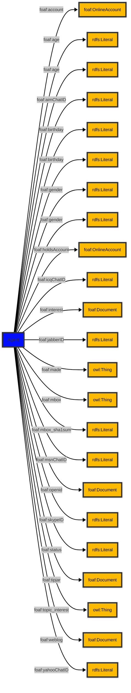

# [Friend of a Friend (FOAF) vocabulary](../homepage.md) > Agent

## Agent

> **An agent (eg. person, group, software or physical artifact).**


| Predicate | Label | Comment | Type |
| -------------------------------- | -------------------------------- | ------------------------------------ | ---- |
| |
| foaf:account | "account" | "Indicates an account held by this agent." |[foaf:OnlineAccount](OnlineAccount.md) | |
| foaf:age | "age" | "The age in years of some agent." |[rdfs:Literal](<http://www.w3.org/2000/01/rdf-schema#Literal>) | |
| foaf:age | "age" | "The age in years of some agent." |[rdfs:Literal](<http://www.w3.org/2000/01/rdf-schema#Literal>) | |
| foaf:aimChatID | "AIM chat ID" | "An AIM chat ID" |[rdfs:Literal](<http://www.w3.org/2000/01/rdf-schema#Literal>) | |
| foaf:birthday | "birthday" | "The birthday of this Agent, represented in mm-dd string form, eg. '12-31'." |[rdfs:Literal](<http://www.w3.org/2000/01/rdf-schema#Literal>) | |
| foaf:birthday | "birthday" | "The birthday of this Agent, represented in mm-dd string form, eg. '12-31'." |[rdfs:Literal](<http://www.w3.org/2000/01/rdf-schema#Literal>) | |
| foaf:gender | "gender" | "The gender of this Agent (typically but not necessarily 'male' or 'female')." |[rdfs:Literal](<http://www.w3.org/2000/01/rdf-schema#Literal>) | |
| foaf:gender | "gender" | "The gender of this Agent (typically but not necessarily 'male' or 'female')." |[rdfs:Literal](<http://www.w3.org/2000/01/rdf-schema#Literal>) | |
| foaf:holdsAccount | "account" | "Indicates an account held by this agent." |[foaf:OnlineAccount](OnlineAccount.md) | |
| foaf:icqChatID | "ICQ chat ID" | "An ICQ chat ID" |[rdfs:Literal](<http://www.w3.org/2000/01/rdf-schema#Literal>) | |
| foaf:interest | "interest" | "A page about a topic of interest to this person." |[foaf:Document](Document.md) | |
| foaf:jabberID | "jabber ID" | "A jabber ID for something." |[rdfs:Literal](<http://www.w3.org/2000/01/rdf-schema#Literal>) | |
| foaf:made | "made" | "Something that was made by this agent." |[owl:Thing](<http://www.w3.org/2002/07/owl#Thing>) | |
| foaf:mbox | "personal mailbox" | "A  personal mailbox, ie. an Internet mailbox associated with exactly one owner, the first owner of this mailbox. This is a 'static inverse functional property', in that  there is (across time and change) at most one individual that ever has any particular value for foaf:mbox." |[owl:Thing](<http://www.w3.org/2002/07/owl#Thing>) | |
| foaf:mbox_sha1sum | "sha1sum of a personal mailbox URI name" | "The sha1sum of the URI of an Internet mailbox associated with exactly one owner, the  first owner of the mailbox." |[rdfs:Literal](<http://www.w3.org/2000/01/rdf-schema#Literal>) | |
| foaf:msnChatID | "MSN chat ID" | "An MSN chat ID" |[rdfs:Literal](<http://www.w3.org/2000/01/rdf-schema#Literal>) | |
| foaf:openid | "openid" | "An OpenID for an Agent." |[foaf:Document](Document.md) | |
| foaf:skypeID | "Skype ID" | "A Skype ID" |[rdfs:Literal](<http://www.w3.org/2000/01/rdf-schema#Literal>) | |
| foaf:status | "status" | "A string expressing what the user is happy for the general public (normally) to know about their current activity." |[rdfs:Literal](<http://www.w3.org/2000/01/rdf-schema#Literal>) | |
| foaf:tipjar | "tipjar" | "A tipjar document for this agent, describing means for payment and reward." |[foaf:Document](Document.md) | |
| foaf:topic_interest | "topic_interest" | "A thing of interest to this person." |[owl:Thing](<http://www.w3.org/2002/07/owl#Thing>) | |
| foaf:weblog | "weblog" | "A weblog of some thing (whether person, group, company etc.)." |[foaf:Document](Document.md) | |
| foaf:yahooChatID | "Yahoo chat ID" | "A Yahoo chat ID" |[rdfs:Literal](<http://www.w3.org/2000/01/rdf-schema#Literal>) |

## Schema




## Serialized

```ttl
@prefix dcterms: <http://purl.org/dc/terms/> .
@prefix foaf: <http://xmlns.com/foaf/0.1/> .
@prefix ns1: <http://www.w3.org/2003/06/sw-vocab-status/ns#> .
@prefix owl: <http://www.w3.org/2002/07/owl#> .
@prefix rdfs: <http://www.w3.org/2000/01/rdf-schema#> .

foaf:Agent a rdfs:Class,
        owl:Class ;
    rdfs:label "Agent" ;
    rdfs:comment "An agent (eg. person, group, software or physical artifact)." ;
    owl:equivalentClass dcterms:Agent ;
    ns1:term_status "stable" .


```

---

Documentation generated on 2025-04-25

Generated with [📑 ontodoc](https://github.com/StephaneBranly/ontodoc), *v0.0.1*