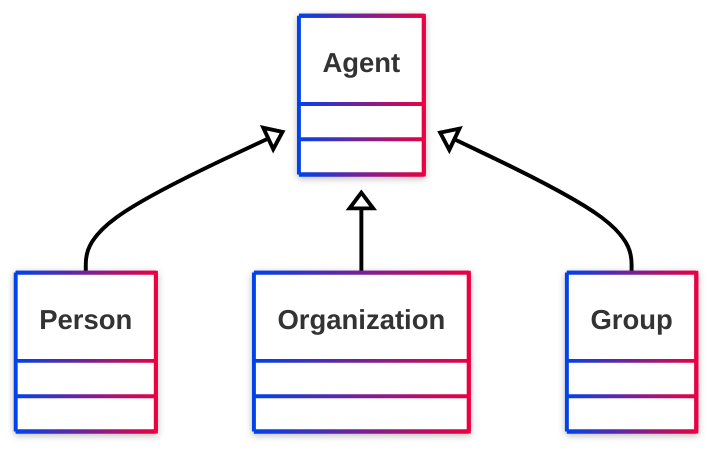

# [Friend of a Friend (FOAF) vocabulary](../homepage.md) > Agent

## Agent

> **An agent (eg. person, group, software or physical artifact).**

## Schema



## Properties

### Class properties
| Predicate | Label | Comment | Type |
| -------------------------------- | -------------------------------- | ------------------------------------ | ---- |
| |
|<kbd>[foaf:account](../property/account)</kbd> | account | Indicates an account held by this agent. |<kbd>[foaf:OnlineAccount](../class/OnlineAccount.md)</kbd> | |
|<kbd>[foaf:age](../property/age)</kbd> | age | The age in years of some agent. |<kbd>[rdfs:Literal](<http://www.w3.org/2000/01/rdf-schema#Literal>)</kbd> | |
|<kbd>[foaf:age](../property/age)</kbd> | age | The age in years of some agent. |<kbd>[rdfs:Literal](<http://www.w3.org/2000/01/rdf-schema#Literal>)</kbd> | |
|<kbd>[foaf:aimChatID](../property/aimChatID)</kbd> | AIM chat ID | An AIM chat ID |<kbd>[rdfs:Literal](<http://www.w3.org/2000/01/rdf-schema#Literal>)</kbd> | |
|<kbd>[foaf:birthday](../property/birthday)</kbd> | birthday | The birthday of this Agent, represented in mm-dd string form, eg. '12-31'. |<kbd>[rdfs:Literal](<http://www.w3.org/2000/01/rdf-schema#Literal>)</kbd> | |
|<kbd>[foaf:birthday](../property/birthday)</kbd> | birthday | The birthday of this Agent, represented in mm-dd string form, eg. '12-31'. |<kbd>[rdfs:Literal](<http://www.w3.org/2000/01/rdf-schema#Literal>)</kbd> | |
|<kbd>[foaf:gender](../property/gender)</kbd> | gender | The gender of this Agent (typically but not necessarily 'male' or 'female'). |<kbd>[rdfs:Literal](<http://www.w3.org/2000/01/rdf-schema#Literal>)</kbd> | |
|<kbd>[foaf:gender](../property/gender)</kbd> | gender | The gender of this Agent (typically but not necessarily 'male' or 'female'). |<kbd>[rdfs:Literal](<http://www.w3.org/2000/01/rdf-schema#Literal>)</kbd> | |
|<kbd>[foaf:holdsAccount](../property/holdsAccount)</kbd> | account | Indicates an account held by this agent. |<kbd>[foaf:OnlineAccount](../class/OnlineAccount.md)</kbd> | |
|<kbd>[foaf:icqChatID](../property/icqChatID)</kbd> | ICQ chat ID | An ICQ chat ID |<kbd>[rdfs:Literal](<http://www.w3.org/2000/01/rdf-schema#Literal>)</kbd> | |
|<kbd>[foaf:interest](../property/interest)</kbd> | interest | A page about a topic of interest to this person. |<kbd>[foaf:Document](../class/Document.md)</kbd> | |
|<kbd>[foaf:jabberID](../property/jabberID)</kbd> | jabber ID | A jabber ID for something. |<kbd>[rdfs:Literal](<http://www.w3.org/2000/01/rdf-schema#Literal>)</kbd> | |
|<kbd>[foaf:made](../property/made)</kbd> | made | Something that was made by this agent. |<kbd>[owl:Thing](<http://www.w3.org/2002/07/owl#Thing>)</kbd> | |
|<kbd>[foaf:mbox](../property/mbox)</kbd> | personal mailbox | A  personal mailbox, ie. an Internet mailbox associated with exactly one owner, the first owner of this mailbox. This is a 'static inverse functional property', in that  there is (across time and change) at most one individual that ever has any particular value for foaf:mbox. |<kbd>[owl:Thing](<http://www.w3.org/2002/07/owl#Thing>)</kbd> | |
|<kbd>[foaf:mbox_sha1sum](../property/mbox_sha1sum)</kbd> | sha1sum of a personal mailbox URI name | The sha1sum of the URI of an Internet mailbox associated with exactly one owner, the  first owner of the mailbox. |<kbd>[rdfs:Literal](<http://www.w3.org/2000/01/rdf-schema#Literal>)</kbd> | |
|<kbd>[foaf:msnChatID](../property/msnChatID)</kbd> | MSN chat ID | An MSN chat ID |<kbd>[rdfs:Literal](<http://www.w3.org/2000/01/rdf-schema#Literal>)</kbd> | |
|<kbd>[foaf:openid](../property/openid)</kbd> | openid | An OpenID for an Agent. |<kbd>[foaf:Document](../class/Document.md)</kbd> | |
|<kbd>[foaf:skypeID](../property/skypeID)</kbd> | Skype ID | A Skype ID |<kbd>[rdfs:Literal](<http://www.w3.org/2000/01/rdf-schema#Literal>)</kbd> | |
|<kbd>[foaf:status](../property/status)</kbd> | status | A string expressing what the user is happy for the general public (normally) to know about their current activity. |<kbd>[rdfs:Literal](<http://www.w3.org/2000/01/rdf-schema#Literal>)</kbd> | |
|<kbd>[foaf:tipjar](../property/tipjar)</kbd> | tipjar | A tipjar document for this agent, describing means for payment and reward. |<kbd>[foaf:Document](../class/Document.md)</kbd> | |
|<kbd>[foaf:topic_interest](../property/topic_interest)</kbd> | topic_interest | A thing of interest to this person. |<kbd>[owl:Thing](<http://www.w3.org/2002/07/owl#Thing>)</kbd> | |
|<kbd>[foaf:weblog](../property/weblog)</kbd> | weblog | A weblog of some thing (whether person, group, company etc.). |<kbd>[foaf:Document](../class/Document.md)</kbd> | |
|<kbd>[foaf:yahooChatID](../property/yahooChatID)</kbd> | Yahoo chat ID | A Yahoo chat ID |<kbd>[rdfs:Literal](<http://www.w3.org/2000/01/rdf-schema#Literal>)</kbd> |


## Serialized

```ttl
@prefix dcterms: <http://purl.org/dc/terms/> .
@prefix foaf: <http://xmlns.com/foaf/0.1/> .
@prefix ns1: <http://www.w3.org/2003/06/sw-vocab-status/ns#> .
@prefix owl: <http://www.w3.org/2002/07/owl#> .
@prefix rdfs: <http://www.w3.org/2000/01/rdf-schema#> .

foaf:Agent a rdfs:Class,
        owl:Class ;
    rdfs:label "Agent" ;
    rdfs:comment "An agent (eg. person, group, software or physical artifact)." ;
    owl:equivalentClass dcterms:Agent ;
    ns1:term_status "stable" .


```

---

Documentation generated on 2025-05-11

Generated with <kbd>[📑 ontodoc](https://github.com/StephaneBranly/ontodoc)</kbd>, *v0.0.2*