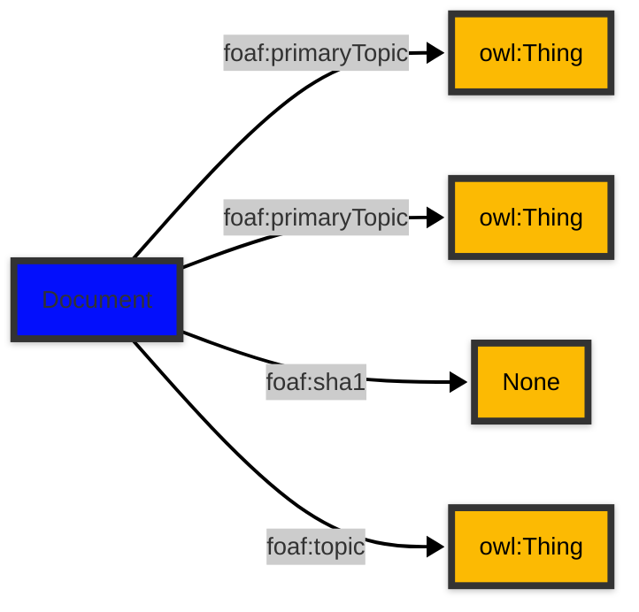

# [Friend of a Friend (FOAF) vocabulary](../homepage.md) > Document

## Document

> **A document.**


| Predicate | Label | Comment | Type |
| -------------------------------- | -------------------------------- | ------------------------------------ | ---- |
| |
| foaf:primaryTopic | "primary topic" | "The primary topic of some page or document." |[owl:Thing](<http://www.w3.org/2002/07/owl#Thing>) | |
| foaf:primaryTopic | "primary topic" | "The primary topic of some page or document." |[owl:Thing](<http://www.w3.org/2002/07/owl#Thing>) | |
| foaf:sha1 | "sha1sum (hex)" | "A sha1sum hash, in hex." |<kbd>None</kbd> | |
| foaf:topic | "topic" | "A topic of some page or document." |[owl:Thing](<http://www.w3.org/2002/07/owl#Thing>) |

## Schema




## Serialized

```ttl
@prefix foaf: <http://xmlns.com/foaf/0.1/> .
@prefix ns1: <http://www.w3.org/2003/06/sw-vocab-status/ns#> .
@prefix owl: <http://www.w3.org/2002/07/owl#> .
@prefix rdfs: <http://www.w3.org/2000/01/rdf-schema#> .

foaf:Document a rdfs:Class,
        owl:Class ;
    rdfs:label "Document" ;
    rdfs:comment "A document." ;
    rdfs:isDefinedBy foaf: ;
    owl:disjointWith foaf:Organization,
        foaf:Project ;
    owl:equivalentClass <http://schema.org/CreativeWork> ;
    ns1:term_status "stable" .


```

---

Documentation generated on 2025-05-01

Generated with [📑 ontodoc](https://github.com/StephaneBranly/ontodoc), *v0.0.1*