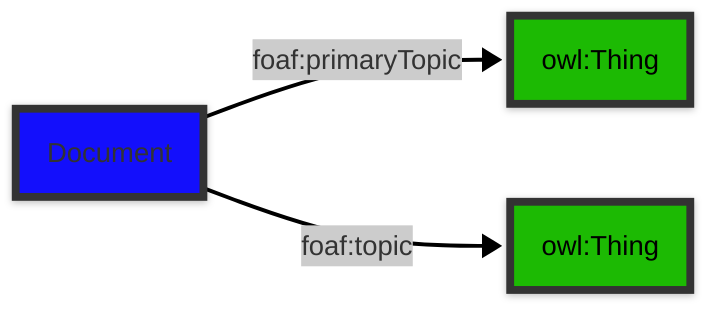

# [Friend of a Friend (FOAF) vocabulary](../homepage.md) > Document

## Document

**A document.**

| Predicate                        | Label                            | Comment                              | Type |
| -------------------------------- | -------------------------------- | ------------------------------------ | ---- |
|   |
| foaf:primaryTopic             | "primary topic" | "The primary topic of some page or document." |<kbd>owl:Thing</kbd> |   |
| foaf:topic             | "topic" | "A topic of some page or document." |<kbd>owl:Thing</kbd> |

## Schema

---

Documentation generated on 2025-04-13

Generated with [📑 ontodoc](https://github.com/StephaneBranly/ontodoc), *v0.0.0*