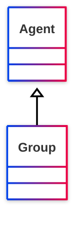

# [Friend of a Friend (FOAF) vocabulary](../homepage.md) > Group

## Group

> **A class of Agents.**

## Schema




## Properties
| Predicate | Label | Comment | Type |
| -------------------------------- | -------------------------------- | ------------------------------------ | ---- |
| |
|[foaf:member](../property/member.md) | "member" | "Indicates a member of a Group" |[foaf:Agent](../class/Agent.md) |


## Serialized

```ttl
@prefix foaf: <http://xmlns.com/foaf/0.1/> .
@prefix ns1: <http://www.w3.org/2003/06/sw-vocab-status/ns#> .
@prefix owl: <http://www.w3.org/2002/07/owl#> .
@prefix rdfs: <http://www.w3.org/2000/01/rdf-schema#> .

foaf:Group a rdfs:Class,
        owl:Class ;
    rdfs:label "Group" ;
    rdfs:comment "A class of Agents." ;
    rdfs:subClassOf foaf:Agent ;
    ns1:term_status "stable" .


```

---

Documentation generated on 2025-05-02

Generated with [📑 ontodoc](https://github.com/StephaneBranly/ontodoc), *v0.0.1*