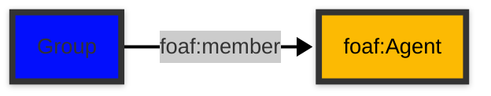

# [Friend of a Friend (FOAF) vocabulary](../homepage.md) > Group

## Group

**A class of Agents.**

| Predicate                        | Label                            | Comment                              | Type |
| -------------------------------- | -------------------------------- | ------------------------------------ | ---- |
|   |
| foaf:member             | "member" | "Indicates a member of a Group" |<kbd>foaf:Agent</kbd> |

## Schema

---

Documentation generated on 2025-04-10

Generated with [📑 ontodoc](https://github.com/StephaneBranly/ontodoc), *v0.0.0*