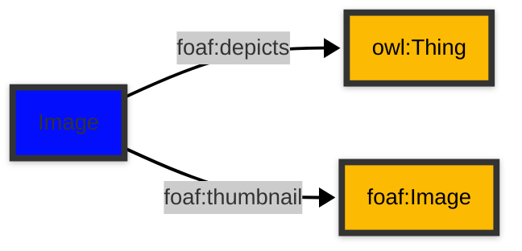

# [Friend of a Friend (FOAF) vocabulary](../homepage.md) > Image

## Image

> **An image.**


| Predicate | Label | Comment | Type |
| -------------------------------- | -------------------------------- | ------------------------------------ | ---- |
| |
| foaf:depicts | "depicts" | "A thing depicted in this representation." |[owl:Thing](<http://www.w3.org/2002/07/owl#Thing>) | |
| foaf:thumbnail | "thumbnail" | "A derived thumbnail image." |[foaf:Image](Image.md) |

## Schema




## Serialized

```ttl
@prefix foaf: <http://xmlns.com/foaf/0.1/> .
@prefix ns1: <http://www.w3.org/2003/06/sw-vocab-status/ns#> .
@prefix owl: <http://www.w3.org/2002/07/owl#> .
@prefix rdfs: <http://www.w3.org/2000/01/rdf-schema#> .

foaf:Image a rdfs:Class,
        owl:Class ;
    rdfs:label "Image" ;
    rdfs:comment "An image." ;
    rdfs:isDefinedBy foaf: ;
    rdfs:subClassOf foaf:Document ;
    owl:equivalentClass <http://schema.org/ImageObject> ;
    ns1:term_status "stable" .


```

---

Documentation generated on 2025-05-01

Generated with [📑 ontodoc](https://github.com/StephaneBranly/ontodoc), *v0.0.1*