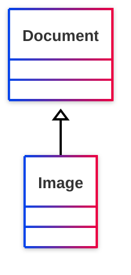

# [Friend of a Friend (FOAF) vocabulary](../homepage.md) > Image
<a name="Image"></a>
## Image

> **An image.**


## Schema



## Properties

### Class properties
| Predicate | Label | Comment | Type |
| -------------------------------- | -------------------------------- | ------------------------------------ | ---- |
| |
|<kbd>[foaf:depicts](../property/depicts.md)</kbd> | depicts | A thing depicted in this representation. |<kbd>[owl:Thing](../<http://www.w3.org/2002/07/owl#Thing>)</kbd> | |
|<kbd>[foaf:thumbnail](../property/thumbnail.md)</kbd> | thumbnail | A derived thumbnail image. |<kbd>[foaf:Image](../class/Image.md)</kbd> |

  
### Inherited from <kbd>[**Document**](../class/Document.md.md)</kbd>
| Predicate | Label | Comment | Type |
| -------------------------------- | -------------------------------- | ------------------------------------ | ---- |
| |
|<kbd>[foaf:primaryTopic](../property/primaryTopic.md)</kbd> | primary topic | The primary topic of some page or document. |<kbd>[owl:Thing](../<http://www.w3.org/2002/07/owl#Thing>)</kbd> | |
|<kbd>[foaf:primaryTopic](../property/primaryTopic.md)</kbd> | primary topic | The primary topic of some page or document. |<kbd>[owl:Thing](../<http://www.w3.org/2002/07/owl#Thing>)</kbd> | |
|<kbd>[foaf:sha1](../property/sha1.md)</kbd> | sha1sum (hex) | A sha1sum hash, in hex. |<kbd>None</kbd> | |
|<kbd>[foaf:topic](../property/topic.md)</kbd> | topic | A topic of some page or document. |<kbd>[owl:Thing](../<http://www.w3.org/2002/07/owl#Thing>)</kbd> |


## Serialized

```ttl
@prefix foaf: <http://xmlns.com/foaf/0.1/> .
@prefix ns1: <http://www.w3.org/2003/06/sw-vocab-status/ns#> .
@prefix owl: <http://www.w3.org/2002/07/owl#> .
@prefix rdfs: <http://www.w3.org/2000/01/rdf-schema#> .

foaf:Image a rdfs:Class,
        owl:Class ;
    rdfs:label "Image" ;
    rdfs:comment "An image." ;
    rdfs:isDefinedBy foaf: ;
    rdfs:subClassOf foaf:Document ;
    owl:equivalentClass <http://schema.org/ImageObject> ;
    ns1:term_status "stable" .


```

---

Documentation generated on 2025-06-25

Generated with <kbd>[📑 ontodoc](https://github.com/StephaneBranly/ontodoc)</kbd>, *v0.0.4*