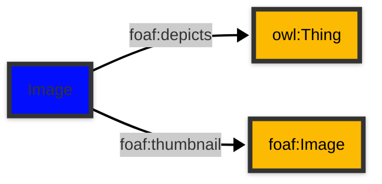

# [Friend of a Friend (FOAF) vocabulary](../homepage.md) > Image

## Image

**An image.**

| Predicate                        | Label                            | Comment                              | Type |
| -------------------------------- | -------------------------------- | ------------------------------------ | ---- |
|   |
| foaf:depicts             | "depicts" | "A thing depicted in this representation." |<kbd>owl:Thing</kbd> |   |
| foaf:thumbnail             | "thumbnail" | "A derived thumbnail image." |<kbd>foaf:Image</kbd> |

## Schema

---

Documentation generated on 2025-04-10

Generated with [📑 ontodoc](https://github.com/StephaneBranly/ontodoc), *v0.0.0*