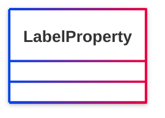

# [Friend of a Friend (FOAF) vocabulary](../homepage.md) > LabelProperty

## Label Property

> **A foaf:LabelProperty is any RDF property with texual values that serve as labels.**

## Schema



## Properties


## Serialized

```ttl
@prefix foaf: <http://xmlns.com/foaf/0.1/> .
@prefix ns1: <http://www.w3.org/2003/06/sw-vocab-status/ns#> .
@prefix owl: <http://www.w3.org/2002/07/owl#> .
@prefix rdfs: <http://www.w3.org/2000/01/rdf-schema#> .

foaf:LabelProperty a rdfs:Class,
        owl:Class ;
    rdfs:label "Label Property" ;
    rdfs:comment "A foaf:LabelProperty is any RDF property with texual values that serve as labels." ;
    rdfs:isDefinedBy foaf: ;
    ns1:term_status "unstable" .


```

---

Documentation generated on 2025-05-13

Generated with <kbd>[📑 ontodoc](https://github.com/StephaneBranly/ontodoc)</kbd>, *v0.0.3*