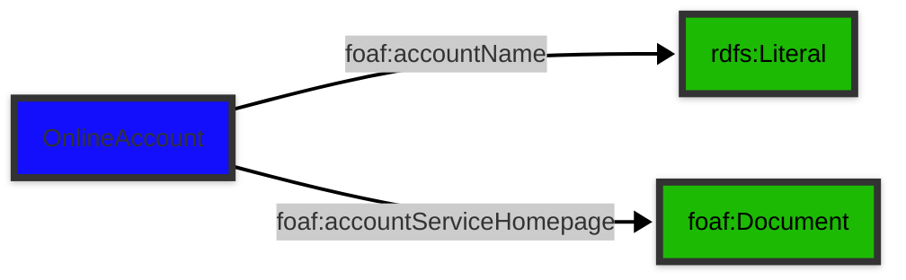

# [Friend of a Friend (FOAF) vocabulary](../homepage.md) > OnlineAccount

## Online Account

**An online account.**

| Predicate                        | Label                            | Comment                              | Type |
| -------------------------------- | -------------------------------- | ------------------------------------ | ---- |
|   |
| foaf:accountName             | "account name" | "Indicates the name (identifier) associated with this online account." |<kbd>rdfs:Literal</kbd> |   |
| foaf:accountServiceHomepage             | "account service homepage" | "Indicates a homepage of the service provide for this online account." |<kbd>foaf:Document</kbd> |

## Schema

---

Documentation generated on 2025-04-13

Generated with [📑 ontodoc](https://github.com/StephaneBranly/ontodoc), *v0.0.0*