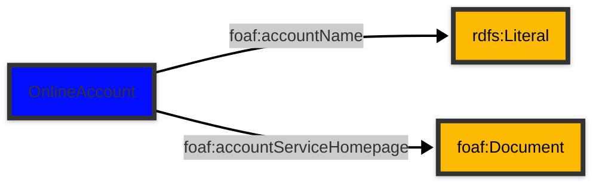

# [Friend of a Friend (FOAF) vocabulary](../homepage.md) > OnlineAccount

## Online Account

> **An online account.**


| Predicate | Label | Comment | Type |
| -------------------------------- | -------------------------------- | ------------------------------------ | ---- |
| |
| foaf:accountName | "account name" | "Indicates the name (identifier) associated with this online account." |[rdfs:Literal](<http://www.w3.org/2000/01/rdf-schema#Literal>) | |
| foaf:accountServiceHomepage | "account service homepage" | "Indicates a homepage of the service provide for this online account." |[foaf:Document](Document.md) |

## Schema




## Serialized

```ttl
@prefix foaf: <http://xmlns.com/foaf/0.1/> .
@prefix ns1: <http://www.w3.org/2003/06/sw-vocab-status/ns#> .
@prefix owl: <http://www.w3.org/2002/07/owl#> .
@prefix rdfs: <http://www.w3.org/2000/01/rdf-schema#> .

foaf:OnlineAccount a rdfs:Class,
        owl:Class ;
    rdfs:label "Online Account" ;
    rdfs:comment "An online account." ;
    rdfs:isDefinedBy foaf: ;
    rdfs:subClassOf owl:Thing ;
    ns1:term_status "testing" .


```

---

Documentation generated on 2025-04-25

Generated with [📑 ontodoc](https://github.com/StephaneBranly/ontodoc), *v0.0.1*