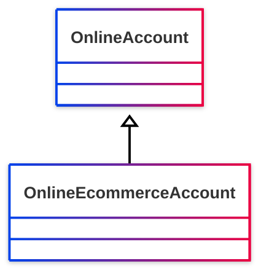

# [Friend of a Friend (FOAF) vocabulary](../homepage.md) > OnlineEcommerceAccount

## Online E-commerce Account

> **An online e-commerce account.**

## Schema



## Properties

  
### Inherited from <kbd>[**Online Account**](../class/OnlineAccount.md)</kbd>
| Predicate | Label | Comment | Type |
| -------------------------------- | -------------------------------- | ------------------------------------ | ---- |
| |
|<kbd>[foaf:accountName](../property/accountName)</kbd> | account name | Indicates the name (identifier) associated with this online account. |<kbd>[rdfs:Literal](<http://www.w3.org/2000/01/rdf-schema#Literal>)</kbd> | |
|<kbd>[foaf:accountServiceHomepage](../property/accountServiceHomepage)</kbd> | account service homepage | Indicates a homepage of the service provide for this online account. |<kbd>[foaf:Document](../class/Document.md)</kbd> |


## Serialized

```ttl
@prefix foaf: <http://xmlns.com/foaf/0.1/> .
@prefix ns1: <http://www.w3.org/2003/06/sw-vocab-status/ns#> .
@prefix owl: <http://www.w3.org/2002/07/owl#> .
@prefix rdfs: <http://www.w3.org/2000/01/rdf-schema#> .

foaf:OnlineEcommerceAccount a rdfs:Class,
        owl:Class ;
    rdfs:label "Online E-commerce Account" ;
    rdfs:comment "An online e-commerce account." ;
    rdfs:isDefinedBy foaf: ;
    rdfs:subClassOf foaf:OnlineAccount ;
    ns1:term_status "unstable" .


```

---

Documentation generated on 2025-05-11

Generated with <kbd>[📑 ontodoc](https://github.com/StephaneBranly/ontodoc)</kbd>, *v0.0.2*