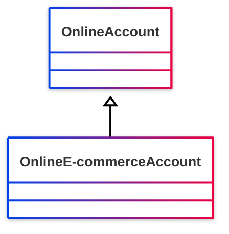

# [Friend of a Friend (FOAF) vocabulary](../homepage.md) > OnlineEcommerceAccount

## Online E-commerce Account

> **An online e-commerce account.**

## Schema




## Serialized

```ttl
@prefix foaf: <http://xmlns.com/foaf/0.1/> .
@prefix ns1: <http://www.w3.org/2003/06/sw-vocab-status/ns#> .
@prefix owl: <http://www.w3.org/2002/07/owl#> .
@prefix rdfs: <http://www.w3.org/2000/01/rdf-schema#> .

foaf:OnlineEcommerceAccount a rdfs:Class,
        owl:Class ;
    rdfs:label "Online E-commerce Account" ;
    rdfs:comment "An online e-commerce account." ;
    rdfs:isDefinedBy foaf: ;
    rdfs:subClassOf foaf:OnlineAccount ;
    ns1:term_status "unstable" .


```

---

Documentation generated on 2025-05-02

Generated with [📑 ontodoc](https://github.com/StephaneBranly/ontodoc), *v0.0.1*