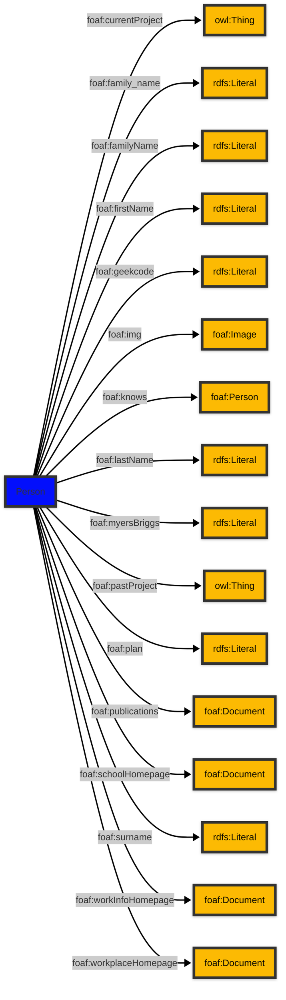

# [Friend of a Friend (FOAF) vocabulary](../homepage.md) > Person

## Person

**A person.**

| Predicate | Label | Comment | Type |
| -------------------------------- | -------------------------------- | ------------------------------------ | ---- |
| |
| foaf:currentProject | "current project" | "A current project this person works on." |<kbd>owl:Thing</kbd> | |
| foaf:family_name | "family_name" | "The family name of some person." |<kbd>rdfs:Literal</kbd> | |
| foaf:familyName | "familyName" | "The family name of some person." |<kbd>rdfs:Literal</kbd> | |
| foaf:firstName | "firstName" | "The first name of a person." |<kbd>rdfs:Literal</kbd> | |
| foaf:geekcode | "geekcode" | "A textual geekcode for this person, see http://www.geekcode.com/geek.html" |<kbd>rdfs:Literal</kbd> | |
| foaf:img | "image" | "An image that can be used to represent some thing (ie. those depictions which are particularly representative of something, eg. one's photo on a homepage)." |<kbd>foaf:Image</kbd> | |
| foaf:knows | "knows" | "A person known by this person (indicating some level of reciprocated interaction between the parties)." |<kbd>foaf:Person</kbd> | |
| foaf:lastName | "lastName" | "The last name of a person." |<kbd>rdfs:Literal</kbd> | |
| foaf:myersBriggs | "myersBriggs" | "A Myers Briggs (MBTI) personality classification." |<kbd>rdfs:Literal</kbd> | |
| foaf:pastProject | "past project" | "A project this person has previously worked on." |<kbd>owl:Thing</kbd> | |
| foaf:plan | "plan" | "A .plan comment, in the tradition of finger and '.plan' files." |<kbd>rdfs:Literal</kbd> | |
| foaf:publications | "publications" | "A link to the publications of this person." |<kbd>foaf:Document</kbd> | |
| foaf:schoolHomepage | "schoolHomepage" | "A homepage of a school attended by the person." |<kbd>foaf:Document</kbd> | |
| foaf:surname | "Surname" | "The surname of some person." |<kbd>rdfs:Literal</kbd> | |
| foaf:workInfoHomepage | "work info homepage" | "A work info homepage of some person; a page about their work for some organization." |<kbd>foaf:Document</kbd> | |
| foaf:workplaceHomepage | "workplace homepage" | "A workplace homepage of some person; the homepage of an organization they work for." |<kbd>foaf:Document</kbd> |

## Schema

---

Documentation generated on 2025-04-16

Generated with [📑 ontodoc](https://github.com/StephaneBranly/ontodoc), *v0.0.0*