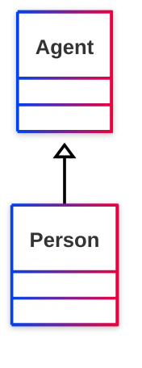

# [Friend of a Friend (FOAF) vocabulary](../homepage.md) > Person
<a name="Person"></a>
## Person

> **A person.**


## Schema



## Properties

### Class properties
| Predicate | Label | Comment | Type |
| -------------------------------- | -------------------------------- | ------------------------------------ | ---- |
| |
|<kbd>[foaf:currentProject](../property/currentProject.md)</kbd> | current project | A current project this person works on. |<kbd>[owl:Thing](../<http://www.w3.org/2002/07/owl#Thing>)</kbd> | |
|<kbd>[foaf:family_name](../property/family_name.md)</kbd> | family_name | The family name of some person. |<kbd>[rdfs:Literal](../<http://www.w3.org/2000/01/rdf-schema#Literal>)</kbd> | |
|<kbd>[foaf:familyName](../property/familyName.md)</kbd> | familyName | The family name of some person. |<kbd>[rdfs:Literal](../<http://www.w3.org/2000/01/rdf-schema#Literal>)</kbd> | |
|<kbd>[foaf:firstName](../property/firstName.md)</kbd> | firstName | The first name of a person. |<kbd>[rdfs:Literal](../<http://www.w3.org/2000/01/rdf-schema#Literal>)</kbd> | |
|<kbd>[foaf:geekcode](../property/geekcode.md)</kbd> | geekcode | A textual geekcode for this person, see http://www.geekcode.com/geek.html |<kbd>[rdfs:Literal](../<http://www.w3.org/2000/01/rdf-schema#Literal>)</kbd> | |
|<kbd>[foaf:img](../property/img.md)</kbd> | image | An image that can be used to represent some thing (ie. those depictions which are particularly representative of something, eg. one's photo on a homepage). |<kbd>[foaf:Image](../class/Image.md)</kbd> | |
|<kbd>[foaf:knows](../property/knows.md)</kbd> | knows | A person known by this person (indicating some level of reciprocated interaction between the parties). |<kbd>[foaf:Person](../class/Person.md)</kbd> | |
|<kbd>[foaf:lastName](../property/lastName.md)</kbd> | lastName | The last name of a person. |<kbd>[rdfs:Literal](../<http://www.w3.org/2000/01/rdf-schema#Literal>)</kbd> | |
|<kbd>[foaf:myersBriggs](../property/myersBriggs.md)</kbd> | myersBriggs | A Myers Briggs (MBTI) personality classification. |<kbd>[rdfs:Literal](../<http://www.w3.org/2000/01/rdf-schema#Literal>)</kbd> | |
|<kbd>[foaf:pastProject](../property/pastProject.md)</kbd> | past project | A project this person has previously worked on. |<kbd>[owl:Thing](../<http://www.w3.org/2002/07/owl#Thing>)</kbd> | |
|<kbd>[foaf:plan](../property/plan.md)</kbd> | plan | A .plan comment, in the tradition of finger and '.plan' files. |<kbd>[rdfs:Literal](../<http://www.w3.org/2000/01/rdf-schema#Literal>)</kbd> | |
|<kbd>[foaf:publications](../property/publications.md)</kbd> | publications | A link to the publications of this person. |<kbd>[foaf:Document](../class/Document.md)</kbd> | |
|<kbd>[foaf:schoolHomepage](../property/schoolHomepage.md)</kbd> | schoolHomepage | A homepage of a school attended by the person. |<kbd>[foaf:Document](../class/Document.md)</kbd> | |
|<kbd>[foaf:surname](../property/surname.md)</kbd> | Surname | The surname of some person. |<kbd>[rdfs:Literal](../<http://www.w3.org/2000/01/rdf-schema#Literal>)</kbd> | |
|<kbd>[foaf:workInfoHomepage](../property/workInfoHomepage.md)</kbd> | work info homepage | A work info homepage of some person; a page about their work for some organization. |<kbd>[foaf:Document](../class/Document.md)</kbd> | |
|<kbd>[foaf:workplaceHomepage](../property/workplaceHomepage.md)</kbd> | workplace homepage | A workplace homepage of some person; the homepage of an organization they work for. |<kbd>[foaf:Document](../class/Document.md)</kbd> |

  
### Inherited from <kbd>[**Agent**](../class/Agent.md.md)</kbd>
| Predicate | Label | Comment | Type |
| -------------------------------- | -------------------------------- | ------------------------------------ | ---- |
| |
|<kbd>[foaf:account](../property/account.md)</kbd> | account | Indicates an account held by this agent. |<kbd>[foaf:OnlineAccount](../class/OnlineAccount.md)</kbd> | |
|<kbd>[foaf:age](../property/age.md)</kbd> | age | The age in years of some agent. |<kbd>[rdfs:Literal](../<http://www.w3.org/2000/01/rdf-schema#Literal>)</kbd> | |
|<kbd>[foaf:age](../property/age.md)</kbd> | age | The age in years of some agent. |<kbd>[rdfs:Literal](../<http://www.w3.org/2000/01/rdf-schema#Literal>)</kbd> | |
|<kbd>[foaf:aimChatID](../property/aimChatID.md)</kbd> | AIM chat ID | An AIM chat ID |<kbd>[rdfs:Literal](../<http://www.w3.org/2000/01/rdf-schema#Literal>)</kbd> | |
|<kbd>[foaf:birthday](../property/birthday.md)</kbd> | birthday | The birthday of this Agent, represented in mm-dd string form, eg. '12-31'. |<kbd>[rdfs:Literal](../<http://www.w3.org/2000/01/rdf-schema#Literal>)</kbd> | |
|<kbd>[foaf:birthday](../property/birthday.md)</kbd> | birthday | The birthday of this Agent, represented in mm-dd string form, eg. '12-31'. |<kbd>[rdfs:Literal](../<http://www.w3.org/2000/01/rdf-schema#Literal>)</kbd> | |
|<kbd>[foaf:gender](../property/gender.md)</kbd> | gender | The gender of this Agent (typically but not necessarily 'male' or 'female'). |<kbd>[rdfs:Literal](../<http://www.w3.org/2000/01/rdf-schema#Literal>)</kbd> | |
|<kbd>[foaf:gender](../property/gender.md)</kbd> | gender | The gender of this Agent (typically but not necessarily 'male' or 'female'). |<kbd>[rdfs:Literal](../<http://www.w3.org/2000/01/rdf-schema#Literal>)</kbd> | |
|<kbd>[foaf:holdsAccount](../property/holdsAccount.md)</kbd> | account | Indicates an account held by this agent. |<kbd>[foaf:OnlineAccount](../class/OnlineAccount.md)</kbd> | |
|<kbd>[foaf:icqChatID](../property/icqChatID.md)</kbd> | ICQ chat ID | An ICQ chat ID |<kbd>[rdfs:Literal](../<http://www.w3.org/2000/01/rdf-schema#Literal>)</kbd> | |
|<kbd>[foaf:interest](../property/interest.md)</kbd> | interest | A page about a topic of interest to this person. |<kbd>[foaf:Document](../class/Document.md)</kbd> | |
|<kbd>[foaf:jabberID](../property/jabberID.md)</kbd> | jabber ID | A jabber ID for something. |<kbd>[rdfs:Literal](../<http://www.w3.org/2000/01/rdf-schema#Literal>)</kbd> | |
|<kbd>[foaf:made](../property/made.md)</kbd> | made | Something that was made by this agent. |<kbd>[owl:Thing](../<http://www.w3.org/2002/07/owl#Thing>)</kbd> | |
|<kbd>[foaf:mbox](../property/mbox.md)</kbd> | personal mailbox | A  personal mailbox, ie. an Internet mailbox associated with exactly one owner, the first owner of this mailbox. This is a 'static inverse functional property', in that  there is (across time and change) at most one individual that ever has any particular value for foaf:mbox. |<kbd>[owl:Thing](../<http://www.w3.org/2002/07/owl#Thing>)</kbd> | |
|<kbd>[foaf:mbox_sha1sum](../property/mbox_sha1sum.md)</kbd> | sha1sum of a personal mailbox URI name | The sha1sum of the URI of an Internet mailbox associated with exactly one owner, the  first owner of the mailbox. |<kbd>[rdfs:Literal](../<http://www.w3.org/2000/01/rdf-schema#Literal>)</kbd> | |
|<kbd>[foaf:msnChatID](../property/msnChatID.md)</kbd> | MSN chat ID | An MSN chat ID |<kbd>[rdfs:Literal](../<http://www.w3.org/2000/01/rdf-schema#Literal>)</kbd> | |
|<kbd>[foaf:openid](../property/openid.md)</kbd> | openid | An OpenID for an Agent. |<kbd>[foaf:Document](../class/Document.md)</kbd> | |
|<kbd>[foaf:skypeID](../property/skypeID.md)</kbd> | Skype ID | A Skype ID |<kbd>[rdfs:Literal](../<http://www.w3.org/2000/01/rdf-schema#Literal>)</kbd> | |
|<kbd>[foaf:status](../property/status.md)</kbd> | status | A string expressing what the user is happy for the general public (normally) to know about their current activity. |<kbd>[rdfs:Literal](../<http://www.w3.org/2000/01/rdf-schema#Literal>)</kbd> | |
|<kbd>[foaf:tipjar](../property/tipjar.md)</kbd> | tipjar | A tipjar document for this agent, describing means for payment and reward. |<kbd>[foaf:Document](../class/Document.md)</kbd> | |
|<kbd>[foaf:topic_interest](../property/topic_interest.md)</kbd> | topic_interest | A thing of interest to this person. |<kbd>[owl:Thing](../<http://www.w3.org/2002/07/owl#Thing>)</kbd> | |
|<kbd>[foaf:weblog](../property/weblog.md)</kbd> | weblog | A weblog of some thing (whether person, group, company etc.). |<kbd>[foaf:Document](../class/Document.md)</kbd> | |
|<kbd>[foaf:yahooChatID](../property/yahooChatID.md)</kbd> | Yahoo chat ID | A Yahoo chat ID |<kbd>[rdfs:Literal](../<http://www.w3.org/2000/01/rdf-schema#Literal>)</kbd> |


## Serialized

```ttl
@prefix foaf: <http://xmlns.com/foaf/0.1/> .
@prefix ns1: <http://www.w3.org/2003/06/sw-vocab-status/ns#> .
@prefix owl: <http://www.w3.org/2002/07/owl#> .
@prefix rdfs: <http://www.w3.org/2000/01/rdf-schema#> .

foaf:Person a rdfs:Class,
        owl:Class ;
    rdfs:label "Person" ;
    rdfs:comment "A person." ;
    rdfs:isDefinedBy foaf: ;
    rdfs:subClassOf <http://www.w3.org/2003/01/geo/wgs84_pos#SpatialThing>,
        foaf:Agent ;
    owl:disjointWith foaf:Organization,
        foaf:Project ;
    owl:equivalentClass <http://schema.org/Person>,
        <http://www.w3.org/2000/10/swap/pim/contact#Person> ;
    ns1:term_status "stable" .


```

---

Documentation generated on 2025-06-25

Generated with <kbd>[📑 ontodoc](https://github.com/StephaneBranly/ontodoc)</kbd>, *v0.0.4*