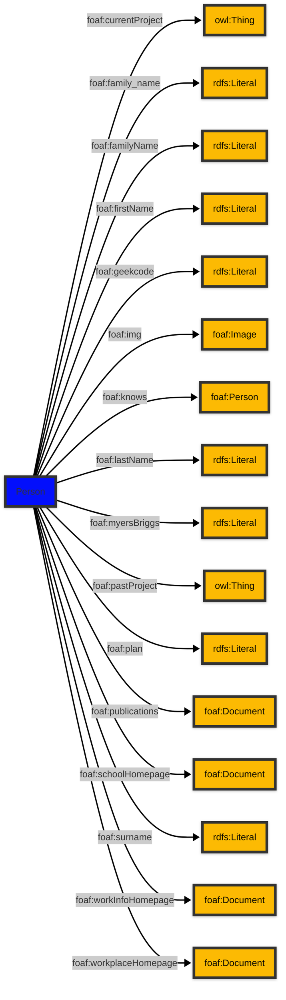

# [Friend of a Friend (FOAF) vocabulary](../homepage.md) > Person

## Person

> **A person.**


| Predicate | Label | Comment | Type |
| -------------------------------- | -------------------------------- | ------------------------------------ | ---- |
| |
| foaf:currentProject | "current project" | "A current project this person works on." |[owl:Thing](<http://www.w3.org/2002/07/owl#Thing>) | |
| foaf:family_name | "family_name" | "The family name of some person." |[rdfs:Literal](<http://www.w3.org/2000/01/rdf-schema#Literal>) | |
| foaf:familyName | "familyName" | "The family name of some person." |[rdfs:Literal](<http://www.w3.org/2000/01/rdf-schema#Literal>) | |
| foaf:firstName | "firstName" | "The first name of a person." |[rdfs:Literal](<http://www.w3.org/2000/01/rdf-schema#Literal>) | |
| foaf:geekcode | "geekcode" | "A textual geekcode for this person, see http://www.geekcode.com/geek.html" |[rdfs:Literal](<http://www.w3.org/2000/01/rdf-schema#Literal>) | |
| foaf:img | "image" | "An image that can be used to represent some thing (ie. those depictions which are particularly representative of something, eg. one's photo on a homepage)." |[foaf:Image](Image.md) | |
| foaf:knows | "knows" | "A person known by this person (indicating some level of reciprocated interaction between the parties)." |[foaf:Person](Person.md) | |
| foaf:lastName | "lastName" | "The last name of a person." |[rdfs:Literal](<http://www.w3.org/2000/01/rdf-schema#Literal>) | |
| foaf:myersBriggs | "myersBriggs" | "A Myers Briggs (MBTI) personality classification." |[rdfs:Literal](<http://www.w3.org/2000/01/rdf-schema#Literal>) | |
| foaf:pastProject | "past project" | "A project this person has previously worked on." |[owl:Thing](<http://www.w3.org/2002/07/owl#Thing>) | |
| foaf:plan | "plan" | "A .plan comment, in the tradition of finger and '.plan' files." |[rdfs:Literal](<http://www.w3.org/2000/01/rdf-schema#Literal>) | |
| foaf:publications | "publications" | "A link to the publications of this person." |[foaf:Document](Document.md) | |
| foaf:schoolHomepage | "schoolHomepage" | "A homepage of a school attended by the person." |[foaf:Document](Document.md) | |
| foaf:surname | "Surname" | "The surname of some person." |[rdfs:Literal](<http://www.w3.org/2000/01/rdf-schema#Literal>) | |
| foaf:workInfoHomepage | "work info homepage" | "A work info homepage of some person; a page about their work for some organization." |[foaf:Document](Document.md) | |
| foaf:workplaceHomepage | "workplace homepage" | "A workplace homepage of some person; the homepage of an organization they work for." |[foaf:Document](Document.md) |

## Schema




## Serialized

```ttl
@prefix foaf: <http://xmlns.com/foaf/0.1/> .
@prefix ns1: <http://www.w3.org/2003/06/sw-vocab-status/ns#> .
@prefix owl: <http://www.w3.org/2002/07/owl#> .
@prefix rdfs: <http://www.w3.org/2000/01/rdf-schema#> .

foaf:Person a rdfs:Class,
        owl:Class ;
    rdfs:label "Person" ;
    rdfs:comment "A person." ;
    rdfs:isDefinedBy foaf: ;
    rdfs:subClassOf <http://www.w3.org/2003/01/geo/wgs84_pos#SpatialThing>,
        foaf:Agent ;
    owl:disjointWith foaf:Organization,
        foaf:Project ;
    owl:equivalentClass <http://schema.org/Person>,
        <http://www.w3.org/2000/10/swap/pim/contact#Person> ;
    ns1:term_status "stable" .


```

---

Documentation generated on 2025-04-25

Generated with [📑 ontodoc](https://github.com/StephaneBranly/ontodoc), *v0.0.1*