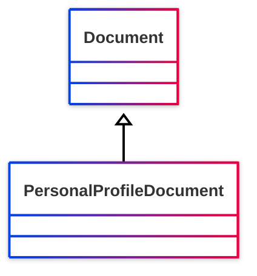

# [Friend of a Friend (FOAF) vocabulary](../homepage.md) > PersonalProfileDocument

## PersonalProfileDocument

> **A personal profile RDF document.**

## Schema




## Serialized

```ttl
@prefix foaf: <http://xmlns.com/foaf/0.1/> .
@prefix ns1: <http://www.w3.org/2003/06/sw-vocab-status/ns#> .
@prefix owl: <http://www.w3.org/2002/07/owl#> .
@prefix rdfs: <http://www.w3.org/2000/01/rdf-schema#> .

foaf:PersonalProfileDocument a rdfs:Class,
        owl:Class ;
    rdfs:label "PersonalProfileDocument" ;
    rdfs:comment "A personal profile RDF document." ;
    rdfs:subClassOf foaf:Document ;
    ns1:term_status "testing" .


```

---

Documentation generated on 2025-05-02

Generated with [📑 ontodoc](https://github.com/StephaneBranly/ontodoc), *v0.0.1*