# Friend of a Friend (FOAF) vocabulary

_http://xmlns.com/foaf/0.1/_

> The Friend of a Friend (FOAF) RDF vocabulary, described using W3C RDF Schema and the Web Ontology Language.

## Summary


- **13** classes
- **65** Properties
  - **33** object
  - **27** datatype
  - **1** annotation
  - **4** functional

## Classes

[Agent](#Agent),[Document](#Document),[Group](#Group),[Image](#Image),[Label Property](#LabelProperty),[Online Account](#OnlineAccount),[Online Chat Account](#OnlineChatAccount),[Online E-commerce Account](#OnlineEcommerceAccount),[Online Gaming Account](#OnlineGamingAccount),[Organization](#Organization),[Person](#Person),[PersonalProfileDocument](#PersonalProfileDocument),[Project](#Project),

## Properties

### Object Properties

[account](#account),[account](#holdsAccount),[account service homepage](#accountServiceHomepage),[based near](#based_near),[current project](#currentProject),[depiction](#depiction),[depicts](#depicts),[focus](#focus),[funded by](#fundedBy),[homepage](#homepage),[image](#img),[interest](#interest),[knows](#knows),[logo](#logo),[made](#made),[maker](#maker),[member](#member),[openid](#openid),[page](#page),[past project](#pastProject),[personal mailbox](#mbox),[phone](#phone),[primary topic](#primaryTopic),[publications](#publications),[schoolHomepage](#schoolHomepage),[theme](#theme),[thumbnail](#thumbnail),[tipjar](#tipjar),[topic](#topic),[topic_interest](#topic_interest),[weblog](#weblog),[work info homepage](#workInfoHomepage),[workplace homepage](#workplaceHomepage),

### Datatype Properties

[account name](#accountName),[age](#age),[AIM chat ID](#aimChatID),[birthday](#birthday),[DNA checksum](#dnaChecksum),[family_name](#family_name),[familyName](#familyName),[firstName](#firstName),[geekcode](#geekcode),[gender](#gender),[Given name](#givenName),[Given name](#givenname),[ICQ chat ID](#icqChatID),[jabber ID](#jabberID),[lastName](#lastName),[MSN chat ID](#msnChatID),[myersBriggs](#myersBriggs),[name](#name),[nickname](#nick),[plan](#plan),[sha1sum (hex)](#sha1),[sha1sum of a personal mailbox URI name](#mbox_sha1sum),[Skype ID](#skypeID),[status](#status),[Surname](#surname),[title](#title),[Yahoo chat ID](#yahooChatID),

### Annotation Properties

[membershipClass](#membershipClass),

### Functional Properties

[age](#age),[birthday](#birthday),[gender](#gender),[primary topic](#primaryTopic),

## Namepaces

- <kbd>dc:</kbd> http://purl.org/dc/terms/,
- <kbd>dc11:</kbd> http://purl.org/dc/elements/1.1/,
- <kbd>foaf:</kbd> http://xmlns.com/foaf/0.1/,
- <kbd>geo:</kbd> http://www.w3.org/2003/01/geo/wgs84_pos#,
- <kbd>ns0:</kbd> http://www.w3.org/2003/06/sw-vocab-status/ns#,
- <kbd>owl:</kbd> http://www.w3.org/2002/07/owl#,
- <kbd>rdf:</kbd> http://www.w3.org/1999/02/22-rdf-syntax-ns#,
- <kbd>rdfs:</kbd> http://www.w3.org/2000/01/rdf-schema#,
- <kbd>schema:</kbd> http://schema.org/,
- <kbd>skos:</kbd> http://www.w3.org/2004/02/skos/core#,
- <kbd>wot:</kbd> http://xmlns.com/wot/0.1/,

## Download ontology

[Ontology available here](./ontology.ttl)

# [Friend of a Friend (FOAF) vocabulary](../homepage.md) > LabelProperty
<a name="LabelProperty"></a>
## Label Property

> **A foaf:LabelProperty is any RDF property with texual values that serve as labels.**


## Schema

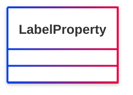

## Properties


## Serialized

```ttl
@prefix foaf: <http://xmlns.com/foaf/0.1/> .
@prefix ns1: <http://www.w3.org/2003/06/sw-vocab-status/ns#> .
@prefix owl: <http://www.w3.org/2002/07/owl#> .
@prefix rdfs: <http://www.w3.org/2000/01/rdf-schema#> .

foaf:LabelProperty a rdfs:Class,
        owl:Class ;
    rdfs:label "Label Property" ;
    rdfs:comment "A foaf:LabelProperty is any RDF property with texual values that serve as labels." ;
    rdfs:isDefinedBy foaf: ;
    ns1:term_status "unstable" .


```

# [Friend of a Friend (FOAF) vocabulary](../homepage.md) > Person
<a name="Person"></a>
## Person

> **A person.**


## Schema

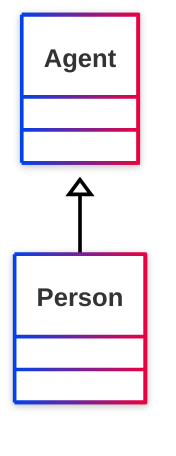

## Properties

### Class properties
| Predicate | Label | Comment | Type |
| -------------------------------- | -------------------------------- | ------------------------------------ | ---- |
| |
|<kbd>[foaf:currentProject](../#currentProject)</kbd> | current project | A current project this person works on. |<kbd>[owl:Thing](<http://www.w3.org/2002/07/owl#Thing>)</kbd> | |
|<kbd>[foaf:family_name](../#family_name)</kbd> | family_name | The family name of some person. |<kbd>[rdfs:Literal](<http://www.w3.org/2000/01/rdf-schema#Literal>)</kbd> | |
|<kbd>[foaf:familyName](../#familyName)</kbd> | familyName | The family name of some person. |<kbd>[rdfs:Literal](<http://www.w3.org/2000/01/rdf-schema#Literal>)</kbd> | |
|<kbd>[foaf:firstName](../#firstName)</kbd> | firstName | The first name of a person. |<kbd>[rdfs:Literal](<http://www.w3.org/2000/01/rdf-schema#Literal>)</kbd> | |
|<kbd>[foaf:geekcode](../#geekcode)</kbd> | geekcode | A textual geekcode for this person, see http://www.geekcode.com/geek.html |<kbd>[rdfs:Literal](<http://www.w3.org/2000/01/rdf-schema#Literal>)</kbd> | |
|<kbd>[foaf:img](../#img)</kbd> | image | An image that can be used to represent some thing (ie. those depictions which are particularly representative of something, eg. one's photo on a homepage). |<kbd>[foaf:Image](#Image)</kbd> | |
|<kbd>[foaf:knows](../#knows)</kbd> | knows | A person known by this person (indicating some level of reciprocated interaction between the parties). |<kbd>[foaf:Person](#Person)</kbd> | |
|<kbd>[foaf:lastName](../#lastName)</kbd> | lastName | The last name of a person. |<kbd>[rdfs:Literal](<http://www.w3.org/2000/01/rdf-schema#Literal>)</kbd> | |
|<kbd>[foaf:myersBriggs](../#myersBriggs)</kbd> | myersBriggs | A Myers Briggs (MBTI) personality classification. |<kbd>[rdfs:Literal](<http://www.w3.org/2000/01/rdf-schema#Literal>)</kbd> | |
|<kbd>[foaf:pastProject](../#pastProject)</kbd> | past project | A project this person has previously worked on. |<kbd>[owl:Thing](<http://www.w3.org/2002/07/owl#Thing>)</kbd> | |
|<kbd>[foaf:plan](../#plan)</kbd> | plan | A .plan comment, in the tradition of finger and '.plan' files. |<kbd>[rdfs:Literal](<http://www.w3.org/2000/01/rdf-schema#Literal>)</kbd> | |
|<kbd>[foaf:publications](../#publications)</kbd> | publications | A link to the publications of this person. |<kbd>[foaf:Document](#Document)</kbd> | |
|<kbd>[foaf:schoolHomepage](../#schoolHomepage)</kbd> | schoolHomepage | A homepage of a school attended by the person. |<kbd>[foaf:Document](#Document)</kbd> | |
|<kbd>[foaf:surname](../#surname)</kbd> | Surname | The surname of some person. |<kbd>[rdfs:Literal](<http://www.w3.org/2000/01/rdf-schema#Literal>)</kbd> | |
|<kbd>[foaf:workInfoHomepage](../#workInfoHomepage)</kbd> | work info homepage | A work info homepage of some person; a page about their work for some organization. |<kbd>[foaf:Document](#Document)</kbd> | |
|<kbd>[foaf:workplaceHomepage](../#workplaceHomepage)</kbd> | workplace homepage | A workplace homepage of some person; the homepage of an organization they work for. |<kbd>[foaf:Document](#Document)</kbd> |

  
### Inherited from <kbd>[**Agent**](../#Agent.md)</kbd>
| Predicate | Label | Comment | Type |
| -------------------------------- | -------------------------------- | ------------------------------------ | ---- |
| |
|<kbd>[foaf:account](../#account)</kbd> | account | Indicates an account held by this agent. |<kbd>[foaf:OnlineAccount](#OnlineAccount)</kbd> | |
|<kbd>[foaf:age](../#age)</kbd> | age | The age in years of some agent. |<kbd>[rdfs:Literal](<http://www.w3.org/2000/01/rdf-schema#Literal>)</kbd> | |
|<kbd>[foaf:age](../#age)</kbd> | age | The age in years of some agent. |<kbd>[rdfs:Literal](<http://www.w3.org/2000/01/rdf-schema#Literal>)</kbd> | |
|<kbd>[foaf:aimChatID](../#aimChatID)</kbd> | AIM chat ID | An AIM chat ID |<kbd>[rdfs:Literal](<http://www.w3.org/2000/01/rdf-schema#Literal>)</kbd> | |
|<kbd>[foaf:birthday](../#birthday)</kbd> | birthday | The birthday of this Agent, represented in mm-dd string form, eg. '12-31'. |<kbd>[rdfs:Literal](<http://www.w3.org/2000/01/rdf-schema#Literal>)</kbd> | |
|<kbd>[foaf:birthday](../#birthday)</kbd> | birthday | The birthday of this Agent, represented in mm-dd string form, eg. '12-31'. |<kbd>[rdfs:Literal](<http://www.w3.org/2000/01/rdf-schema#Literal>)</kbd> | |
|<kbd>[foaf:gender](../#gender)</kbd> | gender | The gender of this Agent (typically but not necessarily 'male' or 'female'). |<kbd>[rdfs:Literal](<http://www.w3.org/2000/01/rdf-schema#Literal>)</kbd> | |
|<kbd>[foaf:gender](../#gender)</kbd> | gender | The gender of this Agent (typically but not necessarily 'male' or 'female'). |<kbd>[rdfs:Literal](<http://www.w3.org/2000/01/rdf-schema#Literal>)</kbd> | |
|<kbd>[foaf:holdsAccount](../#holdsAccount)</kbd> | account | Indicates an account held by this agent. |<kbd>[foaf:OnlineAccount](#OnlineAccount)</kbd> | |
|<kbd>[foaf:icqChatID](../#icqChatID)</kbd> | ICQ chat ID | An ICQ chat ID |<kbd>[rdfs:Literal](<http://www.w3.org/2000/01/rdf-schema#Literal>)</kbd> | |
|<kbd>[foaf:interest](../#interest)</kbd> | interest | A page about a topic of interest to this person. |<kbd>[foaf:Document](#Document)</kbd> | |
|<kbd>[foaf:jabberID](../#jabberID)</kbd> | jabber ID | A jabber ID for something. |<kbd>[rdfs:Literal](<http://www.w3.org/2000/01/rdf-schema#Literal>)</kbd> | |
|<kbd>[foaf:made](../#made)</kbd> | made | Something that was made by this agent. |<kbd>[owl:Thing](<http://www.w3.org/2002/07/owl#Thing>)</kbd> | |
|<kbd>[foaf:mbox](../#mbox)</kbd> | personal mailbox | A  personal mailbox, ie. an Internet mailbox associated with exactly one owner, the first owner of this mailbox. This is a 'static inverse functional property', in that  there is (across time and change) at most one individual that ever has any particular value for foaf:mbox. |<kbd>[owl:Thing](<http://www.w3.org/2002/07/owl#Thing>)</kbd> | |
|<kbd>[foaf:mbox_sha1sum](../#mbox_sha1sum)</kbd> | sha1sum of a personal mailbox URI name | The sha1sum of the URI of an Internet mailbox associated with exactly one owner, the  first owner of the mailbox. |<kbd>[rdfs:Literal](<http://www.w3.org/2000/01/rdf-schema#Literal>)</kbd> | |
|<kbd>[foaf:msnChatID](../#msnChatID)</kbd> | MSN chat ID | An MSN chat ID |<kbd>[rdfs:Literal](<http://www.w3.org/2000/01/rdf-schema#Literal>)</kbd> | |
|<kbd>[foaf:openid](../#openid)</kbd> | openid | An OpenID for an Agent. |<kbd>[foaf:Document](#Document)</kbd> | |
|<kbd>[foaf:skypeID](../#skypeID)</kbd> | Skype ID | A Skype ID |<kbd>[rdfs:Literal](<http://www.w3.org/2000/01/rdf-schema#Literal>)</kbd> | |
|<kbd>[foaf:status](../#status)</kbd> | status | A string expressing what the user is happy for the general public (normally) to know about their current activity. |<kbd>[rdfs:Literal](<http://www.w3.org/2000/01/rdf-schema#Literal>)</kbd> | |
|<kbd>[foaf:tipjar](../#tipjar)</kbd> | tipjar | A tipjar document for this agent, describing means for payment and reward. |<kbd>[foaf:Document](#Document)</kbd> | |
|<kbd>[foaf:topic_interest](../#topic_interest)</kbd> | topic_interest | A thing of interest to this person. |<kbd>[owl:Thing](<http://www.w3.org/2002/07/owl#Thing>)</kbd> | |
|<kbd>[foaf:weblog](../#weblog)</kbd> | weblog | A weblog of some thing (whether person, group, company etc.). |<kbd>[foaf:Document](#Document)</kbd> | |
|<kbd>[foaf:yahooChatID](../#yahooChatID)</kbd> | Yahoo chat ID | A Yahoo chat ID |<kbd>[rdfs:Literal](<http://www.w3.org/2000/01/rdf-schema#Literal>)</kbd> |


## Serialized

```ttl
@prefix foaf: <http://xmlns.com/foaf/0.1/> .
@prefix ns1: <http://www.w3.org/2003/06/sw-vocab-status/ns#> .
@prefix owl: <http://www.w3.org/2002/07/owl#> .
@prefix rdfs: <http://www.w3.org/2000/01/rdf-schema#> .

foaf:Person a rdfs:Class,
        owl:Class ;
    rdfs:label "Person" ;
    rdfs:comment "A person." ;
    rdfs:isDefinedBy foaf: ;
    rdfs:subClassOf <http://www.w3.org/2003/01/geo/wgs84_pos#SpatialThing>,
        foaf:Agent ;
    owl:disjointWith foaf:Organization,
        foaf:Project ;
    owl:equivalentClass <http://schema.org/Person>,
        <http://www.w3.org/2000/10/swap/pim/contact#Person> ;
    ns1:term_status "stable" .


```

# [Friend of a Friend (FOAF) vocabulary](../homepage.md) > Agent
<a name="Agent"></a>
## Agent

> **An agent (eg. person, group, software or physical artifact).**


## Schema

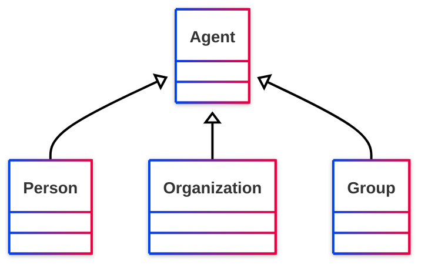

## Properties

### Class properties
| Predicate | Label | Comment | Type |
| -------------------------------- | -------------------------------- | ------------------------------------ | ---- |
| |
|<kbd>[foaf:account](../#account)</kbd> | account | Indicates an account held by this agent. |<kbd>[foaf:OnlineAccount](#OnlineAccount)</kbd> | |
|<kbd>[foaf:age](../#age)</kbd> | age | The age in years of some agent. |<kbd>[rdfs:Literal](<http://www.w3.org/2000/01/rdf-schema#Literal>)</kbd> | |
|<kbd>[foaf:age](../#age)</kbd> | age | The age in years of some agent. |<kbd>[rdfs:Literal](<http://www.w3.org/2000/01/rdf-schema#Literal>)</kbd> | |
|<kbd>[foaf:aimChatID](../#aimChatID)</kbd> | AIM chat ID | An AIM chat ID |<kbd>[rdfs:Literal](<http://www.w3.org/2000/01/rdf-schema#Literal>)</kbd> | |
|<kbd>[foaf:birthday](../#birthday)</kbd> | birthday | The birthday of this Agent, represented in mm-dd string form, eg. '12-31'. |<kbd>[rdfs:Literal](<http://www.w3.org/2000/01/rdf-schema#Literal>)</kbd> | |
|<kbd>[foaf:birthday](../#birthday)</kbd> | birthday | The birthday of this Agent, represented in mm-dd string form, eg. '12-31'. |<kbd>[rdfs:Literal](<http://www.w3.org/2000/01/rdf-schema#Literal>)</kbd> | |
|<kbd>[foaf:gender](../#gender)</kbd> | gender | The gender of this Agent (typically but not necessarily 'male' or 'female'). |<kbd>[rdfs:Literal](<http://www.w3.org/2000/01/rdf-schema#Literal>)</kbd> | |
|<kbd>[foaf:gender](../#gender)</kbd> | gender | The gender of this Agent (typically but not necessarily 'male' or 'female'). |<kbd>[rdfs:Literal](<http://www.w3.org/2000/01/rdf-schema#Literal>)</kbd> | |
|<kbd>[foaf:holdsAccount](../#holdsAccount)</kbd> | account | Indicates an account held by this agent. |<kbd>[foaf:OnlineAccount](#OnlineAccount)</kbd> | |
|<kbd>[foaf:icqChatID](../#icqChatID)</kbd> | ICQ chat ID | An ICQ chat ID |<kbd>[rdfs:Literal](<http://www.w3.org/2000/01/rdf-schema#Literal>)</kbd> | |
|<kbd>[foaf:interest](../#interest)</kbd> | interest | A page about a topic of interest to this person. |<kbd>[foaf:Document](#Document)</kbd> | |
|<kbd>[foaf:jabberID](../#jabberID)</kbd> | jabber ID | A jabber ID for something. |<kbd>[rdfs:Literal](<http://www.w3.org/2000/01/rdf-schema#Literal>)</kbd> | |
|<kbd>[foaf:made](../#made)</kbd> | made | Something that was made by this agent. |<kbd>[owl:Thing](<http://www.w3.org/2002/07/owl#Thing>)</kbd> | |
|<kbd>[foaf:mbox](../#mbox)</kbd> | personal mailbox | A  personal mailbox, ie. an Internet mailbox associated with exactly one owner, the first owner of this mailbox. This is a 'static inverse functional property', in that  there is (across time and change) at most one individual that ever has any particular value for foaf:mbox. |<kbd>[owl:Thing](<http://www.w3.org/2002/07/owl#Thing>)</kbd> | |
|<kbd>[foaf:mbox_sha1sum](../#mbox_sha1sum)</kbd> | sha1sum of a personal mailbox URI name | The sha1sum of the URI of an Internet mailbox associated with exactly one owner, the  first owner of the mailbox. |<kbd>[rdfs:Literal](<http://www.w3.org/2000/01/rdf-schema#Literal>)</kbd> | |
|<kbd>[foaf:msnChatID](../#msnChatID)</kbd> | MSN chat ID | An MSN chat ID |<kbd>[rdfs:Literal](<http://www.w3.org/2000/01/rdf-schema#Literal>)</kbd> | |
|<kbd>[foaf:openid](../#openid)</kbd> | openid | An OpenID for an Agent. |<kbd>[foaf:Document](#Document)</kbd> | |
|<kbd>[foaf:skypeID](../#skypeID)</kbd> | Skype ID | A Skype ID |<kbd>[rdfs:Literal](<http://www.w3.org/2000/01/rdf-schema#Literal>)</kbd> | |
|<kbd>[foaf:status](../#status)</kbd> | status | A string expressing what the user is happy for the general public (normally) to know about their current activity. |<kbd>[rdfs:Literal](<http://www.w3.org/2000/01/rdf-schema#Literal>)</kbd> | |
|<kbd>[foaf:tipjar](../#tipjar)</kbd> | tipjar | A tipjar document for this agent, describing means for payment and reward. |<kbd>[foaf:Document](#Document)</kbd> | |
|<kbd>[foaf:topic_interest](../#topic_interest)</kbd> | topic_interest | A thing of interest to this person. |<kbd>[owl:Thing](<http://www.w3.org/2002/07/owl#Thing>)</kbd> | |
|<kbd>[foaf:weblog](../#weblog)</kbd> | weblog | A weblog of some thing (whether person, group, company etc.). |<kbd>[foaf:Document](#Document)</kbd> | |
|<kbd>[foaf:yahooChatID](../#yahooChatID)</kbd> | Yahoo chat ID | A Yahoo chat ID |<kbd>[rdfs:Literal](<http://www.w3.org/2000/01/rdf-schema#Literal>)</kbd> |


## Serialized

```ttl
@prefix dcterms: <http://purl.org/dc/terms/> .
@prefix foaf: <http://xmlns.com/foaf/0.1/> .
@prefix ns1: <http://www.w3.org/2003/06/sw-vocab-status/ns#> .
@prefix owl: <http://www.w3.org/2002/07/owl#> .
@prefix rdfs: <http://www.w3.org/2000/01/rdf-schema#> .

foaf:Agent a rdfs:Class,
        owl:Class ;
    rdfs:label "Agent" ;
    rdfs:comment "An agent (eg. person, group, software or physical artifact)." ;
    owl:equivalentClass dcterms:Agent ;
    ns1:term_status "stable" .


```

# [Friend of a Friend (FOAF) vocabulary](../homepage.md) > Document
<a name="Document"></a>
## Document

> **A document.**


## Schema

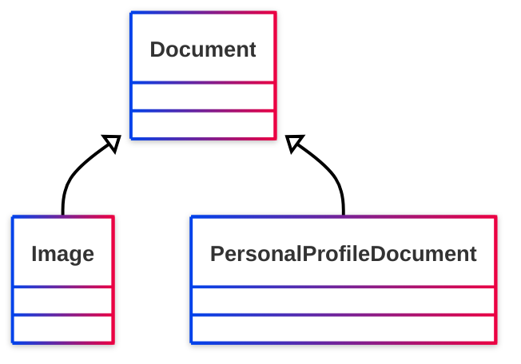

## Properties

### Class properties
| Predicate | Label | Comment | Type |
| -------------------------------- | -------------------------------- | ------------------------------------ | ---- |
| |
|<kbd>[foaf:primaryTopic](../#primaryTopic)</kbd> | primary topic | The primary topic of some page or document. |<kbd>[owl:Thing](<http://www.w3.org/2002/07/owl#Thing>)</kbd> | |
|<kbd>[foaf:primaryTopic](../#primaryTopic)</kbd> | primary topic | The primary topic of some page or document. |<kbd>[owl:Thing](<http://www.w3.org/2002/07/owl#Thing>)</kbd> | |
|<kbd>[foaf:sha1](../#sha1)</kbd> | sha1sum (hex) | A sha1sum hash, in hex. |<kbd>None</kbd> | |
|<kbd>[foaf:topic](../#topic)</kbd> | topic | A topic of some page or document. |<kbd>[owl:Thing](<http://www.w3.org/2002/07/owl#Thing>)</kbd> |


## Serialized

```ttl
@prefix foaf: <http://xmlns.com/foaf/0.1/> .
@prefix ns1: <http://www.w3.org/2003/06/sw-vocab-status/ns#> .
@prefix owl: <http://www.w3.org/2002/07/owl#> .
@prefix rdfs: <http://www.w3.org/2000/01/rdf-schema#> .

foaf:Document a rdfs:Class,
        owl:Class ;
    rdfs:label "Document" ;
    rdfs:comment "A document." ;
    rdfs:isDefinedBy foaf: ;
    owl:disjointWith foaf:Organization,
        foaf:Project ;
    owl:equivalentClass <http://schema.org/CreativeWork> ;
    ns1:term_status "stable" .


```

# [Friend of a Friend (FOAF) vocabulary](../homepage.md) > Organization
<a name="Organization"></a>
## Organization

> **An organization.**


## Schema

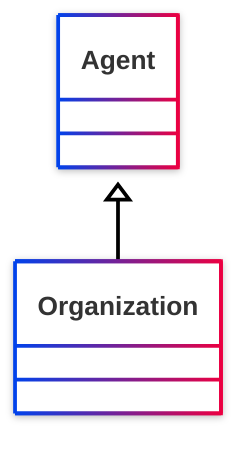

## Properties

  
### Inherited from <kbd>[**Agent**](../#Agent.md)</kbd>
| Predicate | Label | Comment | Type |
| -------------------------------- | -------------------------------- | ------------------------------------ | ---- |
| |
|<kbd>[foaf:account](../#account)</kbd> | account | Indicates an account held by this agent. |<kbd>[foaf:OnlineAccount](#OnlineAccount)</kbd> | |
|<kbd>[foaf:age](../#age)</kbd> | age | The age in years of some agent. |<kbd>[rdfs:Literal](<http://www.w3.org/2000/01/rdf-schema#Literal>)</kbd> | |
|<kbd>[foaf:age](../#age)</kbd> | age | The age in years of some agent. |<kbd>[rdfs:Literal](<http://www.w3.org/2000/01/rdf-schema#Literal>)</kbd> | |
|<kbd>[foaf:aimChatID](../#aimChatID)</kbd> | AIM chat ID | An AIM chat ID |<kbd>[rdfs:Literal](<http://www.w3.org/2000/01/rdf-schema#Literal>)</kbd> | |
|<kbd>[foaf:birthday](../#birthday)</kbd> | birthday | The birthday of this Agent, represented in mm-dd string form, eg. '12-31'. |<kbd>[rdfs:Literal](<http://www.w3.org/2000/01/rdf-schema#Literal>)</kbd> | |
|<kbd>[foaf:birthday](../#birthday)</kbd> | birthday | The birthday of this Agent, represented in mm-dd string form, eg. '12-31'. |<kbd>[rdfs:Literal](<http://www.w3.org/2000/01/rdf-schema#Literal>)</kbd> | |
|<kbd>[foaf:gender](../#gender)</kbd> | gender | The gender of this Agent (typically but not necessarily 'male' or 'female'). |<kbd>[rdfs:Literal](<http://www.w3.org/2000/01/rdf-schema#Literal>)</kbd> | |
|<kbd>[foaf:gender](../#gender)</kbd> | gender | The gender of this Agent (typically but not necessarily 'male' or 'female'). |<kbd>[rdfs:Literal](<http://www.w3.org/2000/01/rdf-schema#Literal>)</kbd> | |
|<kbd>[foaf:holdsAccount](../#holdsAccount)</kbd> | account | Indicates an account held by this agent. |<kbd>[foaf:OnlineAccount](#OnlineAccount)</kbd> | |
|<kbd>[foaf:icqChatID](../#icqChatID)</kbd> | ICQ chat ID | An ICQ chat ID |<kbd>[rdfs:Literal](<http://www.w3.org/2000/01/rdf-schema#Literal>)</kbd> | |
|<kbd>[foaf:interest](../#interest)</kbd> | interest | A page about a topic of interest to this person. |<kbd>[foaf:Document](#Document)</kbd> | |
|<kbd>[foaf:jabberID](../#jabberID)</kbd> | jabber ID | A jabber ID for something. |<kbd>[rdfs:Literal](<http://www.w3.org/2000/01/rdf-schema#Literal>)</kbd> | |
|<kbd>[foaf:made](../#made)</kbd> | made | Something that was made by this agent. |<kbd>[owl:Thing](<http://www.w3.org/2002/07/owl#Thing>)</kbd> | |
|<kbd>[foaf:mbox](../#mbox)</kbd> | personal mailbox | A  personal mailbox, ie. an Internet mailbox associated with exactly one owner, the first owner of this mailbox. This is a 'static inverse functional property', in that  there is (across time and change) at most one individual that ever has any particular value for foaf:mbox. |<kbd>[owl:Thing](<http://www.w3.org/2002/07/owl#Thing>)</kbd> | |
|<kbd>[foaf:mbox_sha1sum](../#mbox_sha1sum)</kbd> | sha1sum of a personal mailbox URI name | The sha1sum of the URI of an Internet mailbox associated with exactly one owner, the  first owner of the mailbox. |<kbd>[rdfs:Literal](<http://www.w3.org/2000/01/rdf-schema#Literal>)</kbd> | |
|<kbd>[foaf:msnChatID](../#msnChatID)</kbd> | MSN chat ID | An MSN chat ID |<kbd>[rdfs:Literal](<http://www.w3.org/2000/01/rdf-schema#Literal>)</kbd> | |
|<kbd>[foaf:openid](../#openid)</kbd> | openid | An OpenID for an Agent. |<kbd>[foaf:Document](#Document)</kbd> | |
|<kbd>[foaf:skypeID](../#skypeID)</kbd> | Skype ID | A Skype ID |<kbd>[rdfs:Literal](<http://www.w3.org/2000/01/rdf-schema#Literal>)</kbd> | |
|<kbd>[foaf:status](../#status)</kbd> | status | A string expressing what the user is happy for the general public (normally) to know about their current activity. |<kbd>[rdfs:Literal](<http://www.w3.org/2000/01/rdf-schema#Literal>)</kbd> | |
|<kbd>[foaf:tipjar](../#tipjar)</kbd> | tipjar | A tipjar document for this agent, describing means for payment and reward. |<kbd>[foaf:Document](#Document)</kbd> | |
|<kbd>[foaf:topic_interest](../#topic_interest)</kbd> | topic_interest | A thing of interest to this person. |<kbd>[owl:Thing](<http://www.w3.org/2002/07/owl#Thing>)</kbd> | |
|<kbd>[foaf:weblog](../#weblog)</kbd> | weblog | A weblog of some thing (whether person, group, company etc.). |<kbd>[foaf:Document](#Document)</kbd> | |
|<kbd>[foaf:yahooChatID](../#yahooChatID)</kbd> | Yahoo chat ID | A Yahoo chat ID |<kbd>[rdfs:Literal](<http://www.w3.org/2000/01/rdf-schema#Literal>)</kbd> |


## Serialized

```ttl
@prefix foaf: <http://xmlns.com/foaf/0.1/> .
@prefix ns1: <http://www.w3.org/2003/06/sw-vocab-status/ns#> .
@prefix owl: <http://www.w3.org/2002/07/owl#> .
@prefix rdfs: <http://www.w3.org/2000/01/rdf-schema#> .

foaf:Organization a rdfs:Class,
        owl:Class ;
    rdfs:label "Organization" ;
    rdfs:comment "An organization." ;
    rdfs:isDefinedBy foaf: ;
    rdfs:subClassOf foaf:Agent ;
    owl:disjointWith foaf:Document,
        foaf:Person ;
    ns1:term_status "stable" .


```

# [Friend of a Friend (FOAF) vocabulary](../homepage.md) > Group
<a name="Group"></a>
## Group

> **A class of Agents.**


## Schema

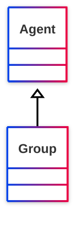

## Properties

### Class properties
| Predicate | Label | Comment | Type |
| -------------------------------- | -------------------------------- | ------------------------------------ | ---- |
| |
|<kbd>[foaf:member](../#member)</kbd> | member | Indicates a member of a Group |<kbd>[foaf:Agent](#Agent)</kbd> |

  
### Inherited from <kbd>[**Agent**](../#Agent.md)</kbd>
| Predicate | Label | Comment | Type |
| -------------------------------- | -------------------------------- | ------------------------------------ | ---- |
| |
|<kbd>[foaf:account](../#account)</kbd> | account | Indicates an account held by this agent. |<kbd>[foaf:OnlineAccount](#OnlineAccount)</kbd> | |
|<kbd>[foaf:age](../#age)</kbd> | age | The age in years of some agent. |<kbd>[rdfs:Literal](<http://www.w3.org/2000/01/rdf-schema#Literal>)</kbd> | |
|<kbd>[foaf:age](../#age)</kbd> | age | The age in years of some agent. |<kbd>[rdfs:Literal](<http://www.w3.org/2000/01/rdf-schema#Literal>)</kbd> | |
|<kbd>[foaf:aimChatID](../#aimChatID)</kbd> | AIM chat ID | An AIM chat ID |<kbd>[rdfs:Literal](<http://www.w3.org/2000/01/rdf-schema#Literal>)</kbd> | |
|<kbd>[foaf:birthday](../#birthday)</kbd> | birthday | The birthday of this Agent, represented in mm-dd string form, eg. '12-31'. |<kbd>[rdfs:Literal](<http://www.w3.org/2000/01/rdf-schema#Literal>)</kbd> | |
|<kbd>[foaf:birthday](../#birthday)</kbd> | birthday | The birthday of this Agent, represented in mm-dd string form, eg. '12-31'. |<kbd>[rdfs:Literal](<http://www.w3.org/2000/01/rdf-schema#Literal>)</kbd> | |
|<kbd>[foaf:gender](../#gender)</kbd> | gender | The gender of this Agent (typically but not necessarily 'male' or 'female'). |<kbd>[rdfs:Literal](<http://www.w3.org/2000/01/rdf-schema#Literal>)</kbd> | |
|<kbd>[foaf:gender](../#gender)</kbd> | gender | The gender of this Agent (typically but not necessarily 'male' or 'female'). |<kbd>[rdfs:Literal](<http://www.w3.org/2000/01/rdf-schema#Literal>)</kbd> | |
|<kbd>[foaf:holdsAccount](../#holdsAccount)</kbd> | account | Indicates an account held by this agent. |<kbd>[foaf:OnlineAccount](#OnlineAccount)</kbd> | |
|<kbd>[foaf:icqChatID](../#icqChatID)</kbd> | ICQ chat ID | An ICQ chat ID |<kbd>[rdfs:Literal](<http://www.w3.org/2000/01/rdf-schema#Literal>)</kbd> | |
|<kbd>[foaf:interest](../#interest)</kbd> | interest | A page about a topic of interest to this person. |<kbd>[foaf:Document](#Document)</kbd> | |
|<kbd>[foaf:jabberID](../#jabberID)</kbd> | jabber ID | A jabber ID for something. |<kbd>[rdfs:Literal](<http://www.w3.org/2000/01/rdf-schema#Literal>)</kbd> | |
|<kbd>[foaf:made](../#made)</kbd> | made | Something that was made by this agent. |<kbd>[owl:Thing](<http://www.w3.org/2002/07/owl#Thing>)</kbd> | |
|<kbd>[foaf:mbox](../#mbox)</kbd> | personal mailbox | A  personal mailbox, ie. an Internet mailbox associated with exactly one owner, the first owner of this mailbox. This is a 'static inverse functional property', in that  there is (across time and change) at most one individual that ever has any particular value for foaf:mbox. |<kbd>[owl:Thing](<http://www.w3.org/2002/07/owl#Thing>)</kbd> | |
|<kbd>[foaf:mbox_sha1sum](../#mbox_sha1sum)</kbd> | sha1sum of a personal mailbox URI name | The sha1sum of the URI of an Internet mailbox associated with exactly one owner, the  first owner of the mailbox. |<kbd>[rdfs:Literal](<http://www.w3.org/2000/01/rdf-schema#Literal>)</kbd> | |
|<kbd>[foaf:msnChatID](../#msnChatID)</kbd> | MSN chat ID | An MSN chat ID |<kbd>[rdfs:Literal](<http://www.w3.org/2000/01/rdf-schema#Literal>)</kbd> | |
|<kbd>[foaf:openid](../#openid)</kbd> | openid | An OpenID for an Agent. |<kbd>[foaf:Document](#Document)</kbd> | |
|<kbd>[foaf:skypeID](../#skypeID)</kbd> | Skype ID | A Skype ID |<kbd>[rdfs:Literal](<http://www.w3.org/2000/01/rdf-schema#Literal>)</kbd> | |
|<kbd>[foaf:status](../#status)</kbd> | status | A string expressing what the user is happy for the general public (normally) to know about their current activity. |<kbd>[rdfs:Literal](<http://www.w3.org/2000/01/rdf-schema#Literal>)</kbd> | |
|<kbd>[foaf:tipjar](../#tipjar)</kbd> | tipjar | A tipjar document for this agent, describing means for payment and reward. |<kbd>[foaf:Document](#Document)</kbd> | |
|<kbd>[foaf:topic_interest](../#topic_interest)</kbd> | topic_interest | A thing of interest to this person. |<kbd>[owl:Thing](<http://www.w3.org/2002/07/owl#Thing>)</kbd> | |
|<kbd>[foaf:weblog](../#weblog)</kbd> | weblog | A weblog of some thing (whether person, group, company etc.). |<kbd>[foaf:Document](#Document)</kbd> | |
|<kbd>[foaf:yahooChatID](../#yahooChatID)</kbd> | Yahoo chat ID | A Yahoo chat ID |<kbd>[rdfs:Literal](<http://www.w3.org/2000/01/rdf-schema#Literal>)</kbd> |


## Serialized

```ttl
@prefix foaf: <http://xmlns.com/foaf/0.1/> .
@prefix ns1: <http://www.w3.org/2003/06/sw-vocab-status/ns#> .
@prefix owl: <http://www.w3.org/2002/07/owl#> .
@prefix rdfs: <http://www.w3.org/2000/01/rdf-schema#> .

foaf:Group a rdfs:Class,
        owl:Class ;
    rdfs:label "Group" ;
    rdfs:comment "A class of Agents." ;
    rdfs:subClassOf foaf:Agent ;
    ns1:term_status "stable" .


```

# [Friend of a Friend (FOAF) vocabulary](../homepage.md) > Project
<a name="Project"></a>
## Project

> **A project (a collective endeavour of some kind).**


## Schema

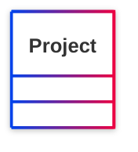

## Properties


## Serialized

```ttl
@prefix foaf: <http://xmlns.com/foaf/0.1/> .
@prefix ns1: <http://www.w3.org/2003/06/sw-vocab-status/ns#> .
@prefix owl: <http://www.w3.org/2002/07/owl#> .
@prefix rdfs: <http://www.w3.org/2000/01/rdf-schema#> .

foaf:Project a rdfs:Class,
        owl:Class ;
    rdfs:label "Project" ;
    rdfs:comment "A project (a collective endeavour of some kind)." ;
    rdfs:isDefinedBy foaf: ;
    owl:disjointWith foaf:Document,
        foaf:Person ;
    ns1:term_status "testing" .


```

# [Friend of a Friend (FOAF) vocabulary](../homepage.md) > Image
<a name="Image"></a>
## Image

> **An image.**


## Schema

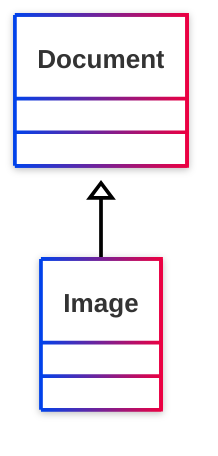

## Properties

### Class properties
| Predicate | Label | Comment | Type |
| -------------------------------- | -------------------------------- | ------------------------------------ | ---- |
| |
|<kbd>[foaf:depicts](../#depicts)</kbd> | depicts | A thing depicted in this representation. |<kbd>[owl:Thing](<http://www.w3.org/2002/07/owl#Thing>)</kbd> | |
|<kbd>[foaf:thumbnail](../#thumbnail)</kbd> | thumbnail | A derived thumbnail image. |<kbd>[foaf:Image](#Image)</kbd> |

  
### Inherited from <kbd>[**Document**](../#Document.md)</kbd>
| Predicate | Label | Comment | Type |
| -------------------------------- | -------------------------------- | ------------------------------------ | ---- |
| |
|<kbd>[foaf:primaryTopic](../#primaryTopic)</kbd> | primary topic | The primary topic of some page or document. |<kbd>[owl:Thing](<http://www.w3.org/2002/07/owl#Thing>)</kbd> | |
|<kbd>[foaf:primaryTopic](../#primaryTopic)</kbd> | primary topic | The primary topic of some page or document. |<kbd>[owl:Thing](<http://www.w3.org/2002/07/owl#Thing>)</kbd> | |
|<kbd>[foaf:sha1](../#sha1)</kbd> | sha1sum (hex) | A sha1sum hash, in hex. |<kbd>None</kbd> | |
|<kbd>[foaf:topic](../#topic)</kbd> | topic | A topic of some page or document. |<kbd>[owl:Thing](<http://www.w3.org/2002/07/owl#Thing>)</kbd> |


## Serialized

```ttl
@prefix foaf: <http://xmlns.com/foaf/0.1/> .
@prefix ns1: <http://www.w3.org/2003/06/sw-vocab-status/ns#> .
@prefix owl: <http://www.w3.org/2002/07/owl#> .
@prefix rdfs: <http://www.w3.org/2000/01/rdf-schema#> .

foaf:Image a rdfs:Class,
        owl:Class ;
    rdfs:label "Image" ;
    rdfs:comment "An image." ;
    rdfs:isDefinedBy foaf: ;
    rdfs:subClassOf foaf:Document ;
    owl:equivalentClass <http://schema.org/ImageObject> ;
    ns1:term_status "stable" .


```

# [Friend of a Friend (FOAF) vocabulary](../homepage.md) > PersonalProfileDocument
<a name="PersonalProfileDocument"></a>
## PersonalProfileDocument

> **A personal profile RDF document.**


## Schema

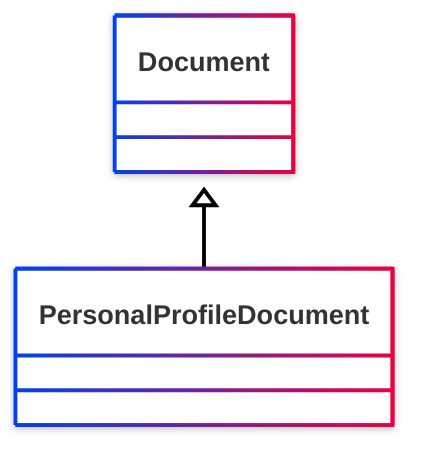

## Properties

  
### Inherited from <kbd>[**Document**](../#Document.md)</kbd>
| Predicate | Label | Comment | Type |
| -------------------------------- | -------------------------------- | ------------------------------------ | ---- |
| |
|<kbd>[foaf:primaryTopic](../#primaryTopic)</kbd> | primary topic | The primary topic of some page or document. |<kbd>[owl:Thing](<http://www.w3.org/2002/07/owl#Thing>)</kbd> | |
|<kbd>[foaf:primaryTopic](../#primaryTopic)</kbd> | primary topic | The primary topic of some page or document. |<kbd>[owl:Thing](<http://www.w3.org/2002/07/owl#Thing>)</kbd> | |
|<kbd>[foaf:sha1](../#sha1)</kbd> | sha1sum (hex) | A sha1sum hash, in hex. |<kbd>None</kbd> | |
|<kbd>[foaf:topic](../#topic)</kbd> | topic | A topic of some page or document. |<kbd>[owl:Thing](<http://www.w3.org/2002/07/owl#Thing>)</kbd> |


## Serialized

```ttl
@prefix foaf: <http://xmlns.com/foaf/0.1/> .
@prefix ns1: <http://www.w3.org/2003/06/sw-vocab-status/ns#> .
@prefix owl: <http://www.w3.org/2002/07/owl#> .
@prefix rdfs: <http://www.w3.org/2000/01/rdf-schema#> .

foaf:PersonalProfileDocument a rdfs:Class,
        owl:Class ;
    rdfs:label "PersonalProfileDocument" ;
    rdfs:comment "A personal profile RDF document." ;
    rdfs:subClassOf foaf:Document ;
    ns1:term_status "testing" .


```

# [Friend of a Friend (FOAF) vocabulary](../homepage.md) > OnlineAccount
<a name="OnlineAccount"></a>
## Online Account

> **An online account.**


## Schema

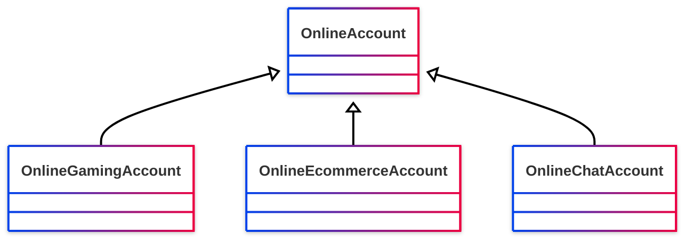

## Properties

### Class properties
| Predicate | Label | Comment | Type |
| -------------------------------- | -------------------------------- | ------------------------------------ | ---- |
| |
|<kbd>[foaf:accountName](../#accountName)</kbd> | account name | Indicates the name (identifier) associated with this online account. |<kbd>[rdfs:Literal](<http://www.w3.org/2000/01/rdf-schema#Literal>)</kbd> | |
|<kbd>[foaf:accountServiceHomepage](../#accountServiceHomepage)</kbd> | account service homepage | Indicates a homepage of the service provide for this online account. |<kbd>[foaf:Document](#Document)</kbd> |


## Serialized

```ttl
@prefix foaf: <http://xmlns.com/foaf/0.1/> .
@prefix ns1: <http://www.w3.org/2003/06/sw-vocab-status/ns#> .
@prefix owl: <http://www.w3.org/2002/07/owl#> .
@prefix rdfs: <http://www.w3.org/2000/01/rdf-schema#> .

foaf:OnlineAccount a rdfs:Class,
        owl:Class ;
    rdfs:label "Online Account" ;
    rdfs:comment "An online account." ;
    rdfs:isDefinedBy foaf: ;
    rdfs:subClassOf owl:Thing ;
    ns1:term_status "testing" .


```

# [Friend of a Friend (FOAF) vocabulary](../homepage.md) > OnlineGamingAccount
<a name="OnlineGamingAccount"></a>
## Online Gaming Account

> **An online gaming account.**


## Schema

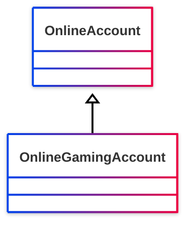

## Properties

  
### Inherited from <kbd>[**Online Account**](../#OnlineAccount.md)</kbd>
| Predicate | Label | Comment | Type |
| -------------------------------- | -------------------------------- | ------------------------------------ | ---- |
| |
|<kbd>[foaf:accountName](../#accountName)</kbd> | account name | Indicates the name (identifier) associated with this online account. |<kbd>[rdfs:Literal](<http://www.w3.org/2000/01/rdf-schema#Literal>)</kbd> | |
|<kbd>[foaf:accountServiceHomepage](../#accountServiceHomepage)</kbd> | account service homepage | Indicates a homepage of the service provide for this online account. |<kbd>[foaf:Document](#Document)</kbd> |


## Serialized

```ttl
@prefix foaf: <http://xmlns.com/foaf/0.1/> .
@prefix ns1: <http://www.w3.org/2003/06/sw-vocab-status/ns#> .
@prefix owl: <http://www.w3.org/2002/07/owl#> .
@prefix rdfs: <http://www.w3.org/2000/01/rdf-schema#> .

foaf:OnlineGamingAccount a rdfs:Class,
        owl:Class ;
    rdfs:label "Online Gaming Account" ;
    rdfs:comment "An online gaming account." ;
    rdfs:isDefinedBy foaf: ;
    rdfs:subClassOf foaf:OnlineAccount ;
    ns1:term_status "unstable" .


```

# [Friend of a Friend (FOAF) vocabulary](../homepage.md) > OnlineEcommerceAccount
<a name="OnlineEcommerceAccount"></a>
## Online E-commerce Account

> **An online e-commerce account.**


## Schema

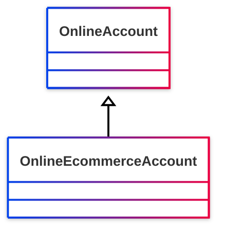

## Properties

  
### Inherited from <kbd>[**Online Account**](../#OnlineAccount.md)</kbd>
| Predicate | Label | Comment | Type |
| -------------------------------- | -------------------------------- | ------------------------------------ | ---- |
| |
|<kbd>[foaf:accountName](../#accountName)</kbd> | account name | Indicates the name (identifier) associated with this online account. |<kbd>[rdfs:Literal](<http://www.w3.org/2000/01/rdf-schema#Literal>)</kbd> | |
|<kbd>[foaf:accountServiceHomepage](../#accountServiceHomepage)</kbd> | account service homepage | Indicates a homepage of the service provide for this online account. |<kbd>[foaf:Document](#Document)</kbd> |


## Serialized

```ttl
@prefix foaf: <http://xmlns.com/foaf/0.1/> .
@prefix ns1: <http://www.w3.org/2003/06/sw-vocab-status/ns#> .
@prefix owl: <http://www.w3.org/2002/07/owl#> .
@prefix rdfs: <http://www.w3.org/2000/01/rdf-schema#> .

foaf:OnlineEcommerceAccount a rdfs:Class,
        owl:Class ;
    rdfs:label "Online E-commerce Account" ;
    rdfs:comment "An online e-commerce account." ;
    rdfs:isDefinedBy foaf: ;
    rdfs:subClassOf foaf:OnlineAccount ;
    ns1:term_status "unstable" .


```

# [Friend of a Friend (FOAF) vocabulary](../homepage.md) > OnlineChatAccount
<a name="OnlineChatAccount"></a>
## Online Chat Account

> **An online chat account.**


## Schema

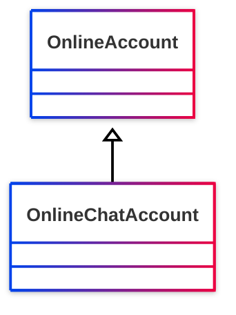

## Properties

  
### Inherited from <kbd>[**Online Account**](../#OnlineAccount.md)</kbd>
| Predicate | Label | Comment | Type |
| -------------------------------- | -------------------------------- | ------------------------------------ | ---- |
| |
|<kbd>[foaf:accountName](../#accountName)</kbd> | account name | Indicates the name (identifier) associated with this online account. |<kbd>[rdfs:Literal](<http://www.w3.org/2000/01/rdf-schema#Literal>)</kbd> | |
|<kbd>[foaf:accountServiceHomepage](../#accountServiceHomepage)</kbd> | account service homepage | Indicates a homepage of the service provide for this online account. |<kbd>[foaf:Document](#Document)</kbd> |


## Serialized

```ttl
@prefix foaf: <http://xmlns.com/foaf/0.1/> .
@prefix ns1: <http://www.w3.org/2003/06/sw-vocab-status/ns#> .
@prefix owl: <http://www.w3.org/2002/07/owl#> .
@prefix rdfs: <http://www.w3.org/2000/01/rdf-schema#> .

foaf:OnlineChatAccount a rdfs:Class,
        owl:Class ;
    rdfs:label "Online Chat Account" ;
    rdfs:comment "An online chat account." ;
    rdfs:isDefinedBy foaf: ;
    rdfs:subClassOf foaf:OnlineAccount ;
    ns1:term_status "unstable" .


```

# [Friend of a Friend (FOAF) vocabulary](../homepage.md) > mbox
<a name="mbox"></a>
## personal mailbox

> **A  personal mailbox, ie. an Internet mailbox associated with exactly one owner, the first owner of this mailbox. This is a 'static inverse functional property', in that  there is (across time and change) at most one individual that ever has any particular value for foaf:mbox.**


- Range :[http://www.w3.org/2002/07/owl#Thing](<http://www.w3.org/2002/07/owl#Thing>)

- Domain :[http://xmlns.com/foaf/0.1/Agent](#Agent)

## Schema

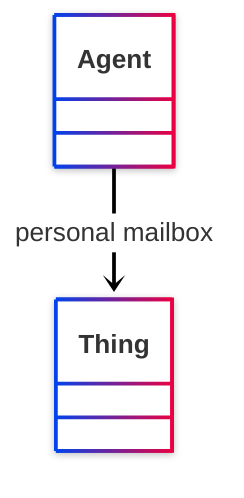

## Serialized

```ttl
@prefix foaf: <http://xmlns.com/foaf/0.1/> .
@prefix ns1: <http://www.w3.org/2003/06/sw-vocab-status/ns#> .
@prefix owl: <http://www.w3.org/2002/07/owl#> .
@prefix rdf: <http://www.w3.org/1999/02/22-rdf-syntax-ns#> .
@prefix rdfs: <http://www.w3.org/2000/01/rdf-schema#> .

foaf:mbox a rdf:Property,
        owl:InverseFunctionalProperty,
        owl:ObjectProperty ;
    rdfs:label "personal mailbox" ;
    rdfs:comment "A  personal mailbox, ie. an Internet mailbox associated with exactly one owner, the first owner of this mailbox. This is a 'static inverse functional property', in that  there is (across time and change) at most one individual that ever has any particular value for foaf:mbox." ;
    rdfs:domain foaf:Agent ;
    rdfs:isDefinedBy foaf: ;
    rdfs:range owl:Thing ;
    ns1:term_status "stable" .


```

# [Friend of a Friend (FOAF) vocabulary](../homepage.md) > based_near
<a name="based_near"></a>
## based near

> **A location that something is based near, for some broadly human notion of near.**


- Range :[http://www.w3.org/2003/01/geo/wgs84_pos#SpatialThing](<http://www.w3.org/2003/01/geo/wgs84_pos#SpatialThing>)

- Domain :[http://www.w3.org/2003/01/geo/wgs84_pos#SpatialThing](<http://www.w3.org/2003/01/geo/wgs84_pos#SpatialThing>)

## Schema

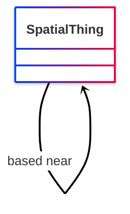

## Serialized

```ttl
@prefix foaf: <http://xmlns.com/foaf/0.1/> .
@prefix ns1: <http://www.w3.org/2003/06/sw-vocab-status/ns#> .
@prefix owl: <http://www.w3.org/2002/07/owl#> .
@prefix rdf: <http://www.w3.org/1999/02/22-rdf-syntax-ns#> .
@prefix rdfs: <http://www.w3.org/2000/01/rdf-schema#> .

foaf:based_near a rdf:Property,
        owl:ObjectProperty ;
    rdfs:label "based near" ;
    rdfs:comment "A location that something is based near, for some broadly human notion of near." ;
    rdfs:domain <http://www.w3.org/2003/01/geo/wgs84_pos#SpatialThing> ;
    rdfs:isDefinedBy foaf: ;
    rdfs:range <http://www.w3.org/2003/01/geo/wgs84_pos#SpatialThing> ;
    ns1:term_status "testing" .


```

# [Friend of a Friend (FOAF) vocabulary](../homepage.md) > phone
<a name="phone"></a>
## phone

> **A phone,  specified using fully qualified tel: URI scheme (refs: http://www.w3.org/Addressing/schemes.html#tel).**


## Serialized

```ttl
@prefix foaf: <http://xmlns.com/foaf/0.1/> .
@prefix ns1: <http://www.w3.org/2003/06/sw-vocab-status/ns#> .
@prefix owl: <http://www.w3.org/2002/07/owl#> .
@prefix rdf: <http://www.w3.org/1999/02/22-rdf-syntax-ns#> .
@prefix rdfs: <http://www.w3.org/2000/01/rdf-schema#> .

foaf:phone a rdf:Property,
        owl:ObjectProperty ;
    rdfs:label "phone" ;
    rdfs:comment "A phone,  specified using fully qualified tel: URI scheme (refs: http://www.w3.org/Addressing/schemes.html#tel)." ;
    rdfs:isDefinedBy foaf: ;
    ns1:term_status "testing" .


```

# [Friend of a Friend (FOAF) vocabulary](../homepage.md) > homepage
<a name="homepage"></a>
## homepage

> **A homepage for some thing.**


- Range :[http://xmlns.com/foaf/0.1/Document](#Document)

- Domain :[http://www.w3.org/2002/07/owl#Thing](<http://www.w3.org/2002/07/owl#Thing>)

## Schema

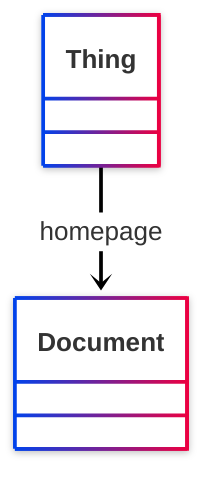

## Serialized

```ttl
@prefix foaf: <http://xmlns.com/foaf/0.1/> .
@prefix ns1: <http://www.w3.org/2003/06/sw-vocab-status/ns#> .
@prefix owl: <http://www.w3.org/2002/07/owl#> .
@prefix rdf: <http://www.w3.org/1999/02/22-rdf-syntax-ns#> .
@prefix rdfs: <http://www.w3.org/2000/01/rdf-schema#> .

foaf:homepage a rdf:Property,
        owl:InverseFunctionalProperty,
        owl:ObjectProperty ;
    rdfs:label "homepage" ;
    rdfs:comment "A homepage for some thing." ;
    rdfs:domain owl:Thing ;
    rdfs:isDefinedBy foaf: ;
    rdfs:range foaf:Document ;
    rdfs:subPropertyOf foaf:isPrimaryTopicOf,
        foaf:page ;
    ns1:term_status "stable" .


```

# [Friend of a Friend (FOAF) vocabulary](../homepage.md) > weblog
<a name="weblog"></a>
## weblog

> **A weblog of some thing (whether person, group, company etc.).**


- Range :[http://xmlns.com/foaf/0.1/Document](#Document)

- Domain :[http://xmlns.com/foaf/0.1/Agent](#Agent)

## Schema

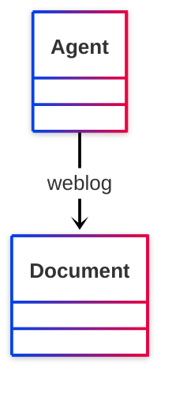

## Serialized

```ttl
@prefix foaf: <http://xmlns.com/foaf/0.1/> .
@prefix ns1: <http://www.w3.org/2003/06/sw-vocab-status/ns#> .
@prefix owl: <http://www.w3.org/2002/07/owl#> .
@prefix rdf: <http://www.w3.org/1999/02/22-rdf-syntax-ns#> .
@prefix rdfs: <http://www.w3.org/2000/01/rdf-schema#> .

foaf:weblog a rdf:Property,
        owl:InverseFunctionalProperty,
        owl:ObjectProperty ;
    rdfs:label "weblog" ;
    rdfs:comment "A weblog of some thing (whether person, group, company etc.)." ;
    rdfs:domain foaf:Agent ;
    rdfs:isDefinedBy foaf: ;
    rdfs:range foaf:Document ;
    rdfs:subPropertyOf foaf:page ;
    ns1:term_status "stable" .


```

# [Friend of a Friend (FOAF) vocabulary](../homepage.md) > openid
<a name="openid"></a>
## openid

> **An OpenID for an Agent.**


- Range :[http://xmlns.com/foaf/0.1/Document](#Document)

- Domain :[http://xmlns.com/foaf/0.1/Agent](#Agent)

## Schema

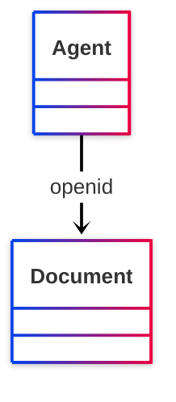

## Serialized

```ttl
@prefix foaf: <http://xmlns.com/foaf/0.1/> .
@prefix ns1: <http://www.w3.org/2003/06/sw-vocab-status/ns#> .
@prefix owl: <http://www.w3.org/2002/07/owl#> .
@prefix rdf: <http://www.w3.org/1999/02/22-rdf-syntax-ns#> .
@prefix rdfs: <http://www.w3.org/2000/01/rdf-schema#> .

foaf:openid a rdf:Property,
        owl:InverseFunctionalProperty,
        owl:ObjectProperty ;
    rdfs:label "openid" ;
    rdfs:comment "An OpenID for an Agent." ;
    rdfs:domain foaf:Agent ;
    rdfs:isDefinedBy foaf: ;
    rdfs:range foaf:Document ;
    rdfs:subPropertyOf foaf:isPrimaryTopicOf ;
    ns1:term_status "testing" .


```

# [Friend of a Friend (FOAF) vocabulary](../homepage.md) > tipjar
<a name="tipjar"></a>
## tipjar

> **A tipjar document for this agent, describing means for payment and reward.**


- Range :[http://xmlns.com/foaf/0.1/Document](#Document)

- Domain :[http://xmlns.com/foaf/0.1/Agent](#Agent)

## Schema

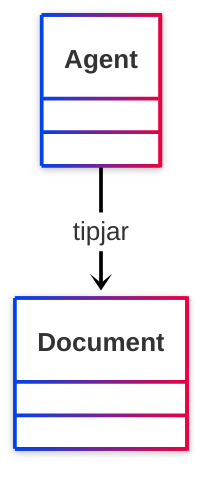

## Serialized

```ttl
@prefix foaf: <http://xmlns.com/foaf/0.1/> .
@prefix ns1: <http://www.w3.org/2003/06/sw-vocab-status/ns#> .
@prefix owl: <http://www.w3.org/2002/07/owl#> .
@prefix rdf: <http://www.w3.org/1999/02/22-rdf-syntax-ns#> .
@prefix rdfs: <http://www.w3.org/2000/01/rdf-schema#> .

foaf:tipjar a rdf:Property,
        owl:ObjectProperty ;
    rdfs:label "tipjar" ;
    rdfs:comment "A tipjar document for this agent, describing means for payment and reward." ;
    rdfs:domain foaf:Agent ;
    rdfs:isDefinedBy foaf: ;
    rdfs:range foaf:Document ;
    rdfs:subPropertyOf foaf:page ;
    ns1:term_status "testing" .


```

# [Friend of a Friend (FOAF) vocabulary](../homepage.md) > made
<a name="made"></a>
## made

> **Something that was made by this agent.**


- Range :[http://www.w3.org/2002/07/owl#Thing](<http://www.w3.org/2002/07/owl#Thing>)

- Domain :[http://xmlns.com/foaf/0.1/Agent](#Agent)

## Schema

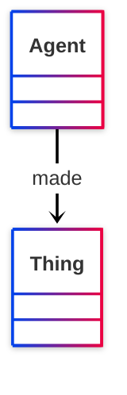

## Serialized

```ttl
@prefix foaf: <http://xmlns.com/foaf/0.1/> .
@prefix ns1: <http://www.w3.org/2003/06/sw-vocab-status/ns#> .
@prefix owl: <http://www.w3.org/2002/07/owl#> .
@prefix rdf: <http://www.w3.org/1999/02/22-rdf-syntax-ns#> .
@prefix rdfs: <http://www.w3.org/2000/01/rdf-schema#> .

foaf:made a rdf:Property,
        owl:ObjectProperty ;
    rdfs:label "made" ;
    rdfs:comment "Something that was made by this agent." ;
    rdfs:domain foaf:Agent ;
    rdfs:isDefinedBy foaf: ;
    rdfs:range owl:Thing ;
    owl:inverseOf foaf:maker ;
    ns1:term_status "stable" .


```

# [Friend of a Friend (FOAF) vocabulary](../homepage.md) > maker
<a name="maker"></a>
## maker

> **An agent that  made this thing.**


- Range :[http://xmlns.com/foaf/0.1/Agent](#Agent)

- Domain :[http://www.w3.org/2002/07/owl#Thing](<http://www.w3.org/2002/07/owl#Thing>)

## Schema

```mermaid
---
config:
  look: neo
  theme: neo
---
classDiagram
    Thing --> Agent : maker
```

## Serialized

```ttl
@prefix dcterms: <http://purl.org/dc/terms/> .
@prefix foaf: <http://xmlns.com/foaf/0.1/> .
@prefix ns1: <http://www.w3.org/2003/06/sw-vocab-status/ns#> .
@prefix owl: <http://www.w3.org/2002/07/owl#> .
@prefix rdf: <http://www.w3.org/1999/02/22-rdf-syntax-ns#> .
@prefix rdfs: <http://www.w3.org/2000/01/rdf-schema#> .

foaf:maker a rdf:Property,
        owl:ObjectProperty ;
    rdfs:label "maker" ;
    rdfs:comment "An agent that  made this thing." ;
    rdfs:domain owl:Thing ;
    rdfs:isDefinedBy foaf: ;
    rdfs:range foaf:Agent ;
    owl:equivalentProperty dcterms:creator ;
    owl:inverseOf foaf:made ;
    ns1:term_status "stable" .


```

# [Friend of a Friend (FOAF) vocabulary](../homepage.md) > img
<a name="img"></a>
## image

> **An image that can be used to represent some thing (ie. those depictions which are particularly representative of something, eg. one's photo on a homepage).**


- Range :[http://xmlns.com/foaf/0.1/Image](#Image)

- Domain :[http://xmlns.com/foaf/0.1/Person](#Person)

## Schema

```mermaid
---
config:
  look: neo
  theme: neo
---
classDiagram
    Person --> Image : image
```

## Serialized

```ttl
@prefix foaf: <http://xmlns.com/foaf/0.1/> .
@prefix ns1: <http://www.w3.org/2003/06/sw-vocab-status/ns#> .
@prefix owl: <http://www.w3.org/2002/07/owl#> .
@prefix rdf: <http://www.w3.org/1999/02/22-rdf-syntax-ns#> .
@prefix rdfs: <http://www.w3.org/2000/01/rdf-schema#> .

foaf:img a rdf:Property,
        owl:ObjectProperty ;
    rdfs:label "image" ;
    rdfs:comment "An image that can be used to represent some thing (ie. those depictions which are particularly representative of something, eg. one's photo on a homepage)." ;
    rdfs:domain foaf:Person ;
    rdfs:isDefinedBy foaf: ;
    rdfs:range foaf:Image ;
    rdfs:subPropertyOf foaf:depiction ;
    ns1:term_status "testing" .


```

# [Friend of a Friend (FOAF) vocabulary](../homepage.md) > depiction
<a name="depiction"></a>
## depiction

> **A depiction of some thing.**


- Range :[http://xmlns.com/foaf/0.1/Image](#Image)

- Domain :[http://www.w3.org/2002/07/owl#Thing](<http://www.w3.org/2002/07/owl#Thing>)

## Schema

```mermaid
---
config:
  look: neo
  theme: neo
---
classDiagram
    Thing --> Image : depiction
```

## Serialized

```ttl
@prefix foaf: <http://xmlns.com/foaf/0.1/> .
@prefix ns1: <http://www.w3.org/2003/06/sw-vocab-status/ns#> .
@prefix owl: <http://www.w3.org/2002/07/owl#> .
@prefix rdf: <http://www.w3.org/1999/02/22-rdf-syntax-ns#> .
@prefix rdfs: <http://www.w3.org/2000/01/rdf-schema#> .

foaf:depiction a rdf:Property,
        owl:ObjectProperty ;
    rdfs:label "depiction" ;
    rdfs:comment "A depiction of some thing." ;
    rdfs:domain owl:Thing ;
    rdfs:isDefinedBy foaf: ;
    rdfs:range foaf:Image ;
    owl:inverseOf foaf:depicts ;
    ns1:term_status "testing" .


```

# [Friend of a Friend (FOAF) vocabulary](../homepage.md) > depicts
<a name="depicts"></a>
## depicts

> **A thing depicted in this representation.**


- Range :[http://www.w3.org/2002/07/owl#Thing](<http://www.w3.org/2002/07/owl#Thing>)

- Domain :[http://xmlns.com/foaf/0.1/Image](#Image)

## Schema

```mermaid
---
config:
  look: neo
  theme: neo
---
classDiagram
    Image --> Thing : depicts
```

## Serialized

```ttl
@prefix foaf: <http://xmlns.com/foaf/0.1/> .
@prefix ns1: <http://www.w3.org/2003/06/sw-vocab-status/ns#> .
@prefix owl: <http://www.w3.org/2002/07/owl#> .
@prefix rdf: <http://www.w3.org/1999/02/22-rdf-syntax-ns#> .
@prefix rdfs: <http://www.w3.org/2000/01/rdf-schema#> .

foaf:depicts a rdf:Property,
        owl:ObjectProperty ;
    rdfs:label "depicts" ;
    rdfs:comment "A thing depicted in this representation." ;
    rdfs:domain foaf:Image ;
    rdfs:isDefinedBy foaf: ;
    rdfs:range owl:Thing ;
    owl:inverseOf foaf:depiction ;
    ns1:term_status "testing" .


```

# [Friend of a Friend (FOAF) vocabulary](../homepage.md) > thumbnail
<a name="thumbnail"></a>
## thumbnail

> **A derived thumbnail image.**


- Range :[http://xmlns.com/foaf/0.1/Image](#Image)

- Domain :[http://xmlns.com/foaf/0.1/Image](#Image)

## Schema

```mermaid
---
config:
  look: neo
  theme: neo
---
classDiagram
    Image --> Image : thumbnail
```

## Serialized

```ttl
@prefix foaf: <http://xmlns.com/foaf/0.1/> .
@prefix ns1: <http://www.w3.org/2003/06/sw-vocab-status/ns#> .
@prefix owl: <http://www.w3.org/2002/07/owl#> .
@prefix rdf: <http://www.w3.org/1999/02/22-rdf-syntax-ns#> .
@prefix rdfs: <http://www.w3.org/2000/01/rdf-schema#> .

foaf:thumbnail a rdf:Property,
        owl:ObjectProperty ;
    rdfs:label "thumbnail" ;
    rdfs:comment "A derived thumbnail image." ;
    rdfs:domain foaf:Image ;
    rdfs:isDefinedBy foaf: ;
    rdfs:range foaf:Image ;
    ns1:term_status "testing" .


```

# [Friend of a Friend (FOAF) vocabulary](../homepage.md) > workplaceHomepage
<a name="workplaceHomepage"></a>
## workplace homepage

> **A workplace homepage of some person; the homepage of an organization they work for.**


- Range :[http://xmlns.com/foaf/0.1/Document](#Document)

- Domain :[http://xmlns.com/foaf/0.1/Person](#Person)

## Schema

```mermaid
---
config:
  look: neo
  theme: neo
---
classDiagram
    Person --> Document : workplace homepage
```

## Serialized

```ttl
@prefix foaf: <http://xmlns.com/foaf/0.1/> .
@prefix ns1: <http://www.w3.org/2003/06/sw-vocab-status/ns#> .
@prefix owl: <http://www.w3.org/2002/07/owl#> .
@prefix rdf: <http://www.w3.org/1999/02/22-rdf-syntax-ns#> .
@prefix rdfs: <http://www.w3.org/2000/01/rdf-schema#> .

foaf:workplaceHomepage a rdf:Property,
        owl:ObjectProperty ;
    rdfs:label "workplace homepage" ;
    rdfs:comment "A workplace homepage of some person; the homepage of an organization they work for." ;
    rdfs:domain foaf:Person ;
    rdfs:isDefinedBy foaf: ;
    rdfs:range foaf:Document ;
    ns1:term_status "testing" .


```

# [Friend of a Friend (FOAF) vocabulary](../homepage.md) > workInfoHomepage
<a name="workInfoHomepage"></a>
## work info homepage

> **A work info homepage of some person; a page about their work for some organization.**


- Range :[http://xmlns.com/foaf/0.1/Document](#Document)

- Domain :[http://xmlns.com/foaf/0.1/Person](#Person)

## Schema

```mermaid
---
config:
  look: neo
  theme: neo
---
classDiagram
    Person --> Document : work info homepage
```

## Serialized

```ttl
@prefix foaf: <http://xmlns.com/foaf/0.1/> .
@prefix ns1: <http://www.w3.org/2003/06/sw-vocab-status/ns#> .
@prefix owl: <http://www.w3.org/2002/07/owl#> .
@prefix rdf: <http://www.w3.org/1999/02/22-rdf-syntax-ns#> .
@prefix rdfs: <http://www.w3.org/2000/01/rdf-schema#> .

foaf:workInfoHomepage a rdf:Property,
        owl:ObjectProperty ;
    rdfs:label "work info homepage" ;
    rdfs:comment "A work info homepage of some person; a page about their work for some organization." ;
    rdfs:domain foaf:Person ;
    rdfs:isDefinedBy foaf: ;
    rdfs:range foaf:Document ;
    ns1:term_status "testing" .


```

# [Friend of a Friend (FOAF) vocabulary](../homepage.md) > schoolHomepage
<a name="schoolHomepage"></a>
## schoolHomepage

> **A homepage of a school attended by the person.**


- Range :[http://xmlns.com/foaf/0.1/Document](#Document)

- Domain :[http://xmlns.com/foaf/0.1/Person](#Person)

## Schema

```mermaid
---
config:
  look: neo
  theme: neo
---
classDiagram
    Person --> Document : schoolHomepage
```

## Serialized

```ttl
@prefix foaf: <http://xmlns.com/foaf/0.1/> .
@prefix ns1: <http://www.w3.org/2003/06/sw-vocab-status/ns#> .
@prefix owl: <http://www.w3.org/2002/07/owl#> .
@prefix rdf: <http://www.w3.org/1999/02/22-rdf-syntax-ns#> .
@prefix rdfs: <http://www.w3.org/2000/01/rdf-schema#> .

foaf:schoolHomepage a rdf:Property,
        owl:ObjectProperty ;
    rdfs:label "schoolHomepage" ;
    rdfs:comment "A homepage of a school attended by the person." ;
    rdfs:domain foaf:Person ;
    rdfs:isDefinedBy foaf: ;
    rdfs:range foaf:Document ;
    ns1:term_status "testing" .


```

# [Friend of a Friend (FOAF) vocabulary](../homepage.md) > knows
<a name="knows"></a>
## knows

> **A person known by this person (indicating some level of reciprocated interaction between the parties).**


- Range :[http://xmlns.com/foaf/0.1/Person](#Person)

- Domain :[http://xmlns.com/foaf/0.1/Person](#Person)

## Schema

```mermaid
---
config:
  look: neo
  theme: neo
---
classDiagram
    Person --> Person : knows
```

## Serialized

```ttl
@prefix foaf: <http://xmlns.com/foaf/0.1/> .
@prefix ns1: <http://www.w3.org/2003/06/sw-vocab-status/ns#> .
@prefix owl: <http://www.w3.org/2002/07/owl#> .
@prefix rdf: <http://www.w3.org/1999/02/22-rdf-syntax-ns#> .
@prefix rdfs: <http://www.w3.org/2000/01/rdf-schema#> .

foaf:knows a rdf:Property,
        owl:ObjectProperty ;
    rdfs:label "knows" ;
    rdfs:comment "A person known by this person (indicating some level of reciprocated interaction between the parties)." ;
    rdfs:domain foaf:Person ;
    rdfs:isDefinedBy foaf: ;
    rdfs:range foaf:Person ;
    ns1:term_status "stable" .


```

# [Friend of a Friend (FOAF) vocabulary](../homepage.md) > interest
<a name="interest"></a>
## interest

> **A page about a topic of interest to this person.**


- Range :[http://xmlns.com/foaf/0.1/Document](#Document)

- Domain :[http://xmlns.com/foaf/0.1/Agent](#Agent)

## Schema

```mermaid
---
config:
  look: neo
  theme: neo
---
classDiagram
    Agent --> Document : interest
```

## Serialized

```ttl
@prefix foaf: <http://xmlns.com/foaf/0.1/> .
@prefix ns1: <http://www.w3.org/2003/06/sw-vocab-status/ns#> .
@prefix owl: <http://www.w3.org/2002/07/owl#> .
@prefix rdf: <http://www.w3.org/1999/02/22-rdf-syntax-ns#> .
@prefix rdfs: <http://www.w3.org/2000/01/rdf-schema#> .

foaf:interest a rdf:Property,
        owl:ObjectProperty ;
    rdfs:label "interest" ;
    rdfs:comment "A page about a topic of interest to this person." ;
    rdfs:domain foaf:Agent ;
    rdfs:isDefinedBy foaf: ;
    rdfs:range foaf:Document ;
    ns1:term_status "testing" .


```

# [Friend of a Friend (FOAF) vocabulary](../homepage.md) > topic_interest
<a name="topic_interest"></a>
## topic_interest

> **A thing of interest to this person.**


- Range :[http://www.w3.org/2002/07/owl#Thing](<http://www.w3.org/2002/07/owl#Thing>)

- Domain :[http://xmlns.com/foaf/0.1/Agent](#Agent)

## Schema

```mermaid
---
config:
  look: neo
  theme: neo
---
classDiagram
    Agent --> Thing : topic_interest
```

## Serialized

```ttl
@prefix foaf: <http://xmlns.com/foaf/0.1/> .
@prefix ns1: <http://www.w3.org/2003/06/sw-vocab-status/ns#> .
@prefix owl: <http://www.w3.org/2002/07/owl#> .
@prefix rdf: <http://www.w3.org/1999/02/22-rdf-syntax-ns#> .
@prefix rdfs: <http://www.w3.org/2000/01/rdf-schema#> .

foaf:topic_interest a rdf:Property,
        owl:ObjectProperty ;
    rdfs:label "topic_interest" ;
    rdfs:comment "A thing of interest to this person." ;
    rdfs:domain foaf:Agent ;
    rdfs:isDefinedBy foaf: ;
    rdfs:range owl:Thing ;
    ns1:term_status "testing" .


```

# [Friend of a Friend (FOAF) vocabulary](../homepage.md) > publications
<a name="publications"></a>
## publications

> **A link to the publications of this person.**


- Range :[http://xmlns.com/foaf/0.1/Document](#Document)

- Domain :[http://xmlns.com/foaf/0.1/Person](#Person)

## Schema

```mermaid
---
config:
  look: neo
  theme: neo
---
classDiagram
    Person --> Document : publications
```

## Serialized

```ttl
@prefix foaf: <http://xmlns.com/foaf/0.1/> .
@prefix ns1: <http://www.w3.org/2003/06/sw-vocab-status/ns#> .
@prefix owl: <http://www.w3.org/2002/07/owl#> .
@prefix rdf: <http://www.w3.org/1999/02/22-rdf-syntax-ns#> .
@prefix rdfs: <http://www.w3.org/2000/01/rdf-schema#> .

foaf:publications a rdf:Property,
        owl:ObjectProperty ;
    rdfs:label "publications" ;
    rdfs:comment "A link to the publications of this person." ;
    rdfs:domain foaf:Person ;
    rdfs:isDefinedBy foaf: ;
    rdfs:range foaf:Document ;
    ns1:term_status "testing" .


```

# [Friend of a Friend (FOAF) vocabulary](../homepage.md) > currentProject
<a name="currentProject"></a>
## current project

> **A current project this person works on.**


- Range :[http://www.w3.org/2002/07/owl#Thing](<http://www.w3.org/2002/07/owl#Thing>)

- Domain :[http://xmlns.com/foaf/0.1/Person](#Person)

## Schema

```mermaid
---
config:
  look: neo
  theme: neo
---
classDiagram
    Person --> Thing : current project
```

## Serialized

```ttl
@prefix foaf: <http://xmlns.com/foaf/0.1/> .
@prefix ns1: <http://www.w3.org/2003/06/sw-vocab-status/ns#> .
@prefix owl: <http://www.w3.org/2002/07/owl#> .
@prefix rdf: <http://www.w3.org/1999/02/22-rdf-syntax-ns#> .
@prefix rdfs: <http://www.w3.org/2000/01/rdf-schema#> .

foaf:currentProject a rdf:Property,
        owl:ObjectProperty ;
    rdfs:label "current project" ;
    rdfs:comment "A current project this person works on." ;
    rdfs:domain foaf:Person ;
    rdfs:isDefinedBy foaf: ;
    rdfs:range owl:Thing ;
    ns1:term_status "testing" .


```

# [Friend of a Friend (FOAF) vocabulary](../homepage.md) > pastProject
<a name="pastProject"></a>
## past project

> **A project this person has previously worked on.**


- Range :[http://www.w3.org/2002/07/owl#Thing](<http://www.w3.org/2002/07/owl#Thing>)

- Domain :[http://xmlns.com/foaf/0.1/Person](#Person)

## Schema

```mermaid
---
config:
  look: neo
  theme: neo
---
classDiagram
    Person --> Thing : past project
```

## Serialized

```ttl
@prefix foaf: <http://xmlns.com/foaf/0.1/> .
@prefix ns1: <http://www.w3.org/2003/06/sw-vocab-status/ns#> .
@prefix owl: <http://www.w3.org/2002/07/owl#> .
@prefix rdf: <http://www.w3.org/1999/02/22-rdf-syntax-ns#> .
@prefix rdfs: <http://www.w3.org/2000/01/rdf-schema#> .

foaf:pastProject a rdf:Property,
        owl:ObjectProperty ;
    rdfs:label "past project" ;
    rdfs:comment "A project this person has previously worked on." ;
    rdfs:domain foaf:Person ;
    rdfs:isDefinedBy foaf: ;
    rdfs:range owl:Thing ;
    ns1:term_status "testing" .


```

# [Friend of a Friend (FOAF) vocabulary](../homepage.md) > fundedBy
<a name="fundedBy"></a>
## funded by

> **An organization funding a project or person.**


- Range :[http://www.w3.org/2002/07/owl#Thing](<http://www.w3.org/2002/07/owl#Thing>)

- Domain :[http://www.w3.org/2002/07/owl#Thing](<http://www.w3.org/2002/07/owl#Thing>)

## Schema

```mermaid
---
config:
  look: neo
  theme: neo
---
classDiagram
    Thing --> Thing : funded by
```

## Serialized

```ttl
@prefix foaf: <http://xmlns.com/foaf/0.1/> .
@prefix ns1: <http://www.w3.org/2003/06/sw-vocab-status/ns#> .
@prefix owl: <http://www.w3.org/2002/07/owl#> .
@prefix rdf: <http://www.w3.org/1999/02/22-rdf-syntax-ns#> .
@prefix rdfs: <http://www.w3.org/2000/01/rdf-schema#> .

foaf:fundedBy a rdf:Property,
        owl:ObjectProperty ;
    rdfs:label "funded by" ;
    rdfs:comment "An organization funding a project or person." ;
    rdfs:domain owl:Thing ;
    rdfs:isDefinedBy foaf: ;
    rdfs:range owl:Thing ;
    ns1:term_status "archaic" .


```

# [Friend of a Friend (FOAF) vocabulary](../homepage.md) > logo
<a name="logo"></a>
## logo

> **A logo representing some thing.**


- Range :[http://www.w3.org/2002/07/owl#Thing](<http://www.w3.org/2002/07/owl#Thing>)

- Domain :[http://www.w3.org/2002/07/owl#Thing](<http://www.w3.org/2002/07/owl#Thing>)

## Schema

```mermaid
---
config:
  look: neo
  theme: neo
---
classDiagram
    Thing --> Thing : logo
```

## Serialized

```ttl
@prefix foaf: <http://xmlns.com/foaf/0.1/> .
@prefix ns1: <http://www.w3.org/2003/06/sw-vocab-status/ns#> .
@prefix owl: <http://www.w3.org/2002/07/owl#> .
@prefix rdf: <http://www.w3.org/1999/02/22-rdf-syntax-ns#> .
@prefix rdfs: <http://www.w3.org/2000/01/rdf-schema#> .

foaf:logo a rdf:Property,
        owl:InverseFunctionalProperty,
        owl:ObjectProperty ;
    rdfs:label "logo" ;
    rdfs:comment "A logo representing some thing." ;
    rdfs:domain owl:Thing ;
    rdfs:isDefinedBy foaf: ;
    rdfs:range owl:Thing ;
    ns1:term_status "testing" .


```

# [Friend of a Friend (FOAF) vocabulary](../homepage.md) > topic
<a name="topic"></a>
## topic

> **A topic of some page or document.**


- Range :[http://www.w3.org/2002/07/owl#Thing](<http://www.w3.org/2002/07/owl#Thing>)

- Domain :[http://xmlns.com/foaf/0.1/Document](#Document)

## Schema

```mermaid
---
config:
  look: neo
  theme: neo
---
classDiagram
    Document --> Thing : topic
```

## Serialized

```ttl
@prefix foaf: <http://xmlns.com/foaf/0.1/> .
@prefix ns1: <http://www.w3.org/2003/06/sw-vocab-status/ns#> .
@prefix owl: <http://www.w3.org/2002/07/owl#> .
@prefix rdf: <http://www.w3.org/1999/02/22-rdf-syntax-ns#> .
@prefix rdfs: <http://www.w3.org/2000/01/rdf-schema#> .

foaf:topic a rdf:Property,
        owl:ObjectProperty ;
    rdfs:label "topic" ;
    rdfs:comment "A topic of some page or document." ;
    rdfs:domain foaf:Document ;
    rdfs:isDefinedBy foaf: ;
    rdfs:range owl:Thing ;
    owl:inverseOf foaf:page ;
    ns1:term_status "testing" .


```

# [Friend of a Friend (FOAF) vocabulary](../homepage.md) > primaryTopic
<a name="primaryTopic"></a>
## primary topic

> **The primary topic of some page or document.**


- Range :[http://www.w3.org/2002/07/owl#Thing](<http://www.w3.org/2002/07/owl#Thing>)

- Domain :[http://xmlns.com/foaf/0.1/Document](#Document)

## Schema

```mermaid
---
config:
  look: neo
  theme: neo
---
classDiagram
    Document --> Thing : primary topic
```

## Serialized

```ttl
@prefix foaf: <http://xmlns.com/foaf/0.1/> .
@prefix ns1: <http://www.w3.org/2003/06/sw-vocab-status/ns#> .
@prefix owl: <http://www.w3.org/2002/07/owl#> .
@prefix rdf: <http://www.w3.org/1999/02/22-rdf-syntax-ns#> .
@prefix rdfs: <http://www.w3.org/2000/01/rdf-schema#> .

foaf:primaryTopic a rdf:Property,
        owl:FunctionalProperty,
        owl:ObjectProperty ;
    rdfs:label "primary topic" ;
    rdfs:comment "The primary topic of some page or document." ;
    rdfs:domain foaf:Document ;
    rdfs:isDefinedBy foaf: ;
    rdfs:range owl:Thing ;
    owl:inverseOf foaf:isPrimaryTopicOf ;
    ns1:term_status "stable" .


```

# [Friend of a Friend (FOAF) vocabulary](../homepage.md) > focus
<a name="focus"></a>
## focus

> **The underlying or 'focal' entity associated with some SKOS-described concept.**


- Range :[http://www.w3.org/2002/07/owl#Thing](<http://www.w3.org/2002/07/owl#Thing>)

- Domain :[http://www.w3.org/2004/02/skos/core#Concept](<http://www.w3.org/2004/02/skos/core#Concept>)

## Schema

```mermaid
---
config:
  look: neo
  theme: neo
---
classDiagram
    Concept --> Thing : focus
```

## Serialized

```ttl
@prefix foaf: <http://xmlns.com/foaf/0.1/> .
@prefix ns1: <http://www.w3.org/2003/06/sw-vocab-status/ns#> .
@prefix owl: <http://www.w3.org/2002/07/owl#> .
@prefix rdf: <http://www.w3.org/1999/02/22-rdf-syntax-ns#> .
@prefix rdfs: <http://www.w3.org/2000/01/rdf-schema#> .
@prefix skos: <http://www.w3.org/2004/02/skos/core#> .

foaf:focus a rdf:Property,
        owl:ObjectProperty ;
    rdfs:label "focus" ;
    rdfs:comment "The underlying or 'focal' entity associated with some SKOS-described concept." ;
    rdfs:domain skos:Concept ;
    rdfs:isDefinedBy foaf: ;
    rdfs:range owl:Thing ;
    ns1:term_status "testing" .


```

# [Friend of a Friend (FOAF) vocabulary](../homepage.md) > page
<a name="page"></a>
## page

> **A page or document about this thing.**


- Range :[http://xmlns.com/foaf/0.1/Document](#Document)

- Domain :[http://www.w3.org/2002/07/owl#Thing](<http://www.w3.org/2002/07/owl#Thing>)

## Schema

```mermaid
---
config:
  look: neo
  theme: neo
---
classDiagram
    Thing --> Document : page
```

## Serialized

```ttl
@prefix foaf: <http://xmlns.com/foaf/0.1/> .
@prefix ns1: <http://www.w3.org/2003/06/sw-vocab-status/ns#> .
@prefix owl: <http://www.w3.org/2002/07/owl#> .
@prefix rdf: <http://www.w3.org/1999/02/22-rdf-syntax-ns#> .
@prefix rdfs: <http://www.w3.org/2000/01/rdf-schema#> .

foaf:page a rdf:Property,
        owl:ObjectProperty ;
    rdfs:label "page" ;
    rdfs:comment "A page or document about this thing." ;
    rdfs:domain owl:Thing ;
    rdfs:isDefinedBy foaf: ;
    rdfs:range foaf:Document ;
    owl:inverseOf foaf:topic ;
    ns1:term_status "stable" .


```

# [Friend of a Friend (FOAF) vocabulary](../homepage.md) > theme
<a name="theme"></a>
## theme

> **A theme.**


- Range :[http://www.w3.org/2002/07/owl#Thing](<http://www.w3.org/2002/07/owl#Thing>)

- Domain :[http://www.w3.org/2002/07/owl#Thing](<http://www.w3.org/2002/07/owl#Thing>)

## Schema

```mermaid
---
config:
  look: neo
  theme: neo
---
classDiagram
    Thing --> Thing : theme
```

## Serialized

```ttl
@prefix foaf: <http://xmlns.com/foaf/0.1/> .
@prefix ns1: <http://www.w3.org/2003/06/sw-vocab-status/ns#> .
@prefix owl: <http://www.w3.org/2002/07/owl#> .
@prefix rdf: <http://www.w3.org/1999/02/22-rdf-syntax-ns#> .
@prefix rdfs: <http://www.w3.org/2000/01/rdf-schema#> .

foaf:theme a rdf:Property,
        owl:ObjectProperty ;
    rdfs:label "theme" ;
    rdfs:comment "A theme." ;
    rdfs:domain owl:Thing ;
    rdfs:isDefinedBy foaf: ;
    rdfs:range owl:Thing ;
    ns1:term_status "archaic" .


```

# [Friend of a Friend (FOAF) vocabulary](../homepage.md) > account
<a name="account"></a>
## account

> **Indicates an account held by this agent.**


- Range :[http://xmlns.com/foaf/0.1/OnlineAccount](#OnlineAccount)

- Domain :[http://xmlns.com/foaf/0.1/Agent](#Agent)

## Schema

```mermaid
---
config:
  look: neo
  theme: neo
---
classDiagram
    Agent --> OnlineAccount : account
```

## Serialized

```ttl
@prefix foaf: <http://xmlns.com/foaf/0.1/> .
@prefix ns1: <http://www.w3.org/2003/06/sw-vocab-status/ns#> .
@prefix owl: <http://www.w3.org/2002/07/owl#> .
@prefix rdf: <http://www.w3.org/1999/02/22-rdf-syntax-ns#> .
@prefix rdfs: <http://www.w3.org/2000/01/rdf-schema#> .

foaf:account a rdf:Property,
        owl:ObjectProperty ;
    rdfs:label "account" ;
    rdfs:comment "Indicates an account held by this agent." ;
    rdfs:domain foaf:Agent ;
    rdfs:isDefinedBy foaf: ;
    rdfs:range foaf:OnlineAccount ;
    ns1:term_status "testing" .


```

# [Friend of a Friend (FOAF) vocabulary](../homepage.md) > holdsAccount
<a name="holdsAccount"></a>
## account

> **Indicates an account held by this agent.**


- Range :[http://xmlns.com/foaf/0.1/OnlineAccount](#OnlineAccount)

- Domain :[http://xmlns.com/foaf/0.1/Agent](#Agent)

## Schema

```mermaid
---
config:
  look: neo
  theme: neo
---
classDiagram
    Agent --> OnlineAccount : account
```

## Serialized

```ttl
@prefix foaf: <http://xmlns.com/foaf/0.1/> .
@prefix ns1: <http://www.w3.org/2003/06/sw-vocab-status/ns#> .
@prefix owl: <http://www.w3.org/2002/07/owl#> .
@prefix rdf: <http://www.w3.org/1999/02/22-rdf-syntax-ns#> .
@prefix rdfs: <http://www.w3.org/2000/01/rdf-schema#> .

foaf:holdsAccount a rdf:Property,
        owl:ObjectProperty ;
    rdfs:label "account" ;
    rdfs:comment "Indicates an account held by this agent." ;
    rdfs:domain foaf:Agent ;
    rdfs:isDefinedBy foaf: ;
    rdfs:range foaf:OnlineAccount ;
    ns1:term_status "archaic" .


```

# [Friend of a Friend (FOAF) vocabulary](../homepage.md) > accountServiceHomepage
<a name="accountServiceHomepage"></a>
## account service homepage

> **Indicates a homepage of the service provide for this online account.**


- Range :[http://xmlns.com/foaf/0.1/Document](#Document)

- Domain :[http://xmlns.com/foaf/0.1/OnlineAccount](#OnlineAccount)

## Schema

```mermaid
---
config:
  look: neo
  theme: neo
---
classDiagram
    OnlineAccount --> Document : account service homepage
```

## Serialized

```ttl
@prefix foaf: <http://xmlns.com/foaf/0.1/> .
@prefix ns1: <http://www.w3.org/2003/06/sw-vocab-status/ns#> .
@prefix owl: <http://www.w3.org/2002/07/owl#> .
@prefix rdf: <http://www.w3.org/1999/02/22-rdf-syntax-ns#> .
@prefix rdfs: <http://www.w3.org/2000/01/rdf-schema#> .

foaf:accountServiceHomepage a rdf:Property,
        owl:ObjectProperty ;
    rdfs:label "account service homepage" ;
    rdfs:comment "Indicates a homepage of the service provide for this online account." ;
    rdfs:domain foaf:OnlineAccount ;
    rdfs:isDefinedBy foaf: ;
    rdfs:range foaf:Document ;
    ns1:term_status "testing" .


```

# [Friend of a Friend (FOAF) vocabulary](../homepage.md) > member
<a name="member"></a>
## member

> **Indicates a member of a Group**


- Range :[http://xmlns.com/foaf/0.1/Agent](#Agent)

- Domain :[http://xmlns.com/foaf/0.1/Group](#Group)

## Schema

```mermaid
---
config:
  look: neo
  theme: neo
---
classDiagram
    Group --> Agent : member
```

## Serialized

```ttl
@prefix foaf: <http://xmlns.com/foaf/0.1/> .
@prefix ns1: <http://www.w3.org/2003/06/sw-vocab-status/ns#> .
@prefix owl: <http://www.w3.org/2002/07/owl#> .
@prefix rdf: <http://www.w3.org/1999/02/22-rdf-syntax-ns#> .
@prefix rdfs: <http://www.w3.org/2000/01/rdf-schema#> .

foaf:member a rdf:Property,
        owl:ObjectProperty ;
    rdfs:label "member" ;
    rdfs:comment "Indicates a member of a Group" ;
    rdfs:domain foaf:Group ;
    rdfs:isDefinedBy foaf: ;
    rdfs:range foaf:Agent ;
    ns1:term_status "stable" .


```

# [Friend of a Friend (FOAF) vocabulary](../homepage.md) > mbox_sha1sum
<a name="mbox_sha1sum"></a>
## sha1sum of a personal mailbox URI name

> **The sha1sum of the URI of an Internet mailbox associated with exactly one owner, the  first owner of the mailbox.**


- Range :[http://www.w3.org/2000/01/rdf-schema#Literal](<http://www.w3.org/2000/01/rdf-schema#Literal>)

- Domain :[http://xmlns.com/foaf/0.1/Agent](#Agent)

## Schema

```mermaid
---
config:
  look: neo
  theme: neo
---
classDiagram
    Agent --> Literal : sha1sum of a personal mailbox URI name
```

## Serialized

```ttl
@prefix foaf: <http://xmlns.com/foaf/0.1/> .
@prefix ns1: <http://www.w3.org/2003/06/sw-vocab-status/ns#> .
@prefix owl: <http://www.w3.org/2002/07/owl#> .
@prefix rdf: <http://www.w3.org/1999/02/22-rdf-syntax-ns#> .
@prefix rdfs: <http://www.w3.org/2000/01/rdf-schema#> .

foaf:mbox_sha1sum a rdf:Property,
        owl:DatatypeProperty,
        owl:InverseFunctionalProperty ;
    rdfs:label "sha1sum of a personal mailbox URI name" ;
    rdfs:comment "The sha1sum of the URI of an Internet mailbox associated with exactly one owner, the  first owner of the mailbox." ;
    rdfs:domain foaf:Agent ;
    rdfs:isDefinedBy foaf: ;
    rdfs:range rdfs:Literal ;
    ns1:term_status "testing" .


```

# [Friend of a Friend (FOAF) vocabulary](../homepage.md) > gender
<a name="gender"></a>
## gender

> **The gender of this Agent (typically but not necessarily 'male' or 'female').**


- Range :[http://www.w3.org/2000/01/rdf-schema#Literal](<http://www.w3.org/2000/01/rdf-schema#Literal>)

- Domain :[http://xmlns.com/foaf/0.1/Agent](#Agent)

## Schema

```mermaid
---
config:
  look: neo
  theme: neo
---
classDiagram
    Agent --> Literal : gender
```

## Serialized

```ttl
@prefix foaf: <http://xmlns.com/foaf/0.1/> .
@prefix ns1: <http://www.w3.org/2003/06/sw-vocab-status/ns#> .
@prefix owl: <http://www.w3.org/2002/07/owl#> .
@prefix rdf: <http://www.w3.org/1999/02/22-rdf-syntax-ns#> .
@prefix rdfs: <http://www.w3.org/2000/01/rdf-schema#> .

foaf:gender a rdf:Property,
        owl:DatatypeProperty,
        owl:FunctionalProperty ;
    rdfs:label "gender" ;
    rdfs:comment "The gender of this Agent (typically but not necessarily 'male' or 'female')." ;
    rdfs:domain foaf:Agent ;
    rdfs:isDefinedBy foaf: ;
    rdfs:range rdfs:Literal ;
    ns1:term_status "testing" .


```

# [Friend of a Friend (FOAF) vocabulary](../homepage.md) > geekcode
<a name="geekcode"></a>
## geekcode

> **A textual geekcode for this person, see http://www.geekcode.com/geek.html**


- Range :[http://www.w3.org/2000/01/rdf-schema#Literal](<http://www.w3.org/2000/01/rdf-schema#Literal>)

- Domain :[http://xmlns.com/foaf/0.1/Person](#Person)

## Schema

```mermaid
---
config:
  look: neo
  theme: neo
---
classDiagram
    Person --> Literal : geekcode
```

## Serialized

```ttl
@prefix foaf: <http://xmlns.com/foaf/0.1/> .
@prefix ns1: <http://www.w3.org/2003/06/sw-vocab-status/ns#> .
@prefix owl: <http://www.w3.org/2002/07/owl#> .
@prefix rdf: <http://www.w3.org/1999/02/22-rdf-syntax-ns#> .
@prefix rdfs: <http://www.w3.org/2000/01/rdf-schema#> .

foaf:geekcode a rdf:Property,
        owl:DatatypeProperty ;
    rdfs:label "geekcode" ;
    rdfs:comment "A textual geekcode for this person, see http://www.geekcode.com/geek.html" ;
    rdfs:domain foaf:Person ;
    rdfs:isDefinedBy foaf: ;
    rdfs:range rdfs:Literal ;
    ns1:term_status "archaic" .


```

# [Friend of a Friend (FOAF) vocabulary](../homepage.md) > dnaChecksum
<a name="dnaChecksum"></a>
## DNA checksum

> **A checksum for the DNA of some thing. Joke.**


- Range :[http://www.w3.org/2000/01/rdf-schema#Literal](<http://www.w3.org/2000/01/rdf-schema#Literal>)


## Serialized

```ttl
@prefix foaf: <http://xmlns.com/foaf/0.1/> .
@prefix ns1: <http://www.w3.org/2003/06/sw-vocab-status/ns#> .
@prefix owl: <http://www.w3.org/2002/07/owl#> .
@prefix rdf: <http://www.w3.org/1999/02/22-rdf-syntax-ns#> .
@prefix rdfs: <http://www.w3.org/2000/01/rdf-schema#> .

foaf:dnaChecksum a rdf:Property,
        owl:DatatypeProperty ;
    rdfs:label "DNA checksum" ;
    rdfs:comment "A checksum for the DNA of some thing. Joke." ;
    rdfs:isDefinedBy foaf: ;
    rdfs:range rdfs:Literal ;
    ns1:term_status "archaic" .


```

# [Friend of a Friend (FOAF) vocabulary](../homepage.md) > sha1
<a name="sha1"></a>
## sha1sum (hex)

> **A sha1sum hash, in hex.**


- Domain :[http://xmlns.com/foaf/0.1/Document](#Document)

## Serialized

```ttl
@prefix foaf: <http://xmlns.com/foaf/0.1/> .
@prefix ns1: <http://www.w3.org/2003/06/sw-vocab-status/ns#> .
@prefix owl: <http://www.w3.org/2002/07/owl#> .
@prefix rdf: <http://www.w3.org/1999/02/22-rdf-syntax-ns#> .
@prefix rdfs: <http://www.w3.org/2000/01/rdf-schema#> .

foaf:sha1 a rdf:Property,
        owl:DatatypeProperty ;
    rdfs:label "sha1sum (hex)" ;
    rdfs:comment "A sha1sum hash, in hex." ;
    rdfs:domain foaf:Document ;
    rdfs:isDefinedBy foaf: ;
    ns1:term_status "unstable" .


```

# [Friend of a Friend (FOAF) vocabulary](../homepage.md) > title
<a name="title"></a>
## title

> **Title (Mr, Mrs, Ms, Dr. etc)**


## Serialized

```ttl
@prefix foaf: <http://xmlns.com/foaf/0.1/> .
@prefix ns1: <http://www.w3.org/2003/06/sw-vocab-status/ns#> .
@prefix owl: <http://www.w3.org/2002/07/owl#> .
@prefix rdf: <http://www.w3.org/1999/02/22-rdf-syntax-ns#> .
@prefix rdfs: <http://www.w3.org/2000/01/rdf-schema#> .

foaf:title a rdf:Property,
        owl:DatatypeProperty ;
    rdfs:label "title" ;
    rdfs:comment "Title (Mr, Mrs, Ms, Dr. etc)" ;
    rdfs:isDefinedBy foaf: ;
    ns1:term_status "testing" .


```

# [Friend of a Friend (FOAF) vocabulary](../homepage.md) > nick
<a name="nick"></a>
## nickname

> **A short informal nickname characterising an agent (includes login identifiers, IRC and other chat nicknames).**


## Serialized

```ttl
@prefix foaf: <http://xmlns.com/foaf/0.1/> .
@prefix ns1: <http://www.w3.org/2003/06/sw-vocab-status/ns#> .
@prefix owl: <http://www.w3.org/2002/07/owl#> .
@prefix rdf: <http://www.w3.org/1999/02/22-rdf-syntax-ns#> .
@prefix rdfs: <http://www.w3.org/2000/01/rdf-schema#> .

foaf:nick a rdf:Property,
        owl:DatatypeProperty ;
    rdfs:label "nickname" ;
    rdfs:comment "A short informal nickname characterising an agent (includes login identifiers, IRC and other chat nicknames)." ;
    rdfs:isDefinedBy foaf: ;
    ns1:term_status "testing" .


```

# [Friend of a Friend (FOAF) vocabulary](../homepage.md) > jabberID
<a name="jabberID"></a>
## jabber ID

> **A jabber ID for something.**


- Range :[http://www.w3.org/2000/01/rdf-schema#Literal](<http://www.w3.org/2000/01/rdf-schema#Literal>)

- Domain :[http://xmlns.com/foaf/0.1/Agent](#Agent)

## Schema

```mermaid
---
config:
  look: neo
  theme: neo
---
classDiagram
    Agent --> Literal : jabber ID
```

## Serialized

```ttl
@prefix foaf: <http://xmlns.com/foaf/0.1/> .
@prefix ns1: <http://www.w3.org/2003/06/sw-vocab-status/ns#> .
@prefix owl: <http://www.w3.org/2002/07/owl#> .
@prefix rdf: <http://www.w3.org/1999/02/22-rdf-syntax-ns#> .
@prefix rdfs: <http://www.w3.org/2000/01/rdf-schema#> .

foaf:jabberID a rdf:Property,
        owl:DatatypeProperty,
        owl:InverseFunctionalProperty ;
    rdfs:label "jabber ID" ;
    rdfs:comment "A jabber ID for something." ;
    rdfs:domain foaf:Agent ;
    rdfs:isDefinedBy foaf: ;
    rdfs:range rdfs:Literal ;
    ns1:term_status "testing" .


```

# [Friend of a Friend (FOAF) vocabulary](../homepage.md) > aimChatID
<a name="aimChatID"></a>
## AIM chat ID

> **An AIM chat ID**


- Range :[http://www.w3.org/2000/01/rdf-schema#Literal](<http://www.w3.org/2000/01/rdf-schema#Literal>)

- Domain :[http://xmlns.com/foaf/0.1/Agent](#Agent)

## Schema

```mermaid
---
config:
  look: neo
  theme: neo
---
classDiagram
    Agent --> Literal : AIM chat ID
```

## Serialized

```ttl
@prefix foaf: <http://xmlns.com/foaf/0.1/> .
@prefix ns1: <http://www.w3.org/2003/06/sw-vocab-status/ns#> .
@prefix owl: <http://www.w3.org/2002/07/owl#> .
@prefix rdf: <http://www.w3.org/1999/02/22-rdf-syntax-ns#> .
@prefix rdfs: <http://www.w3.org/2000/01/rdf-schema#> .

foaf:aimChatID a rdf:Property,
        owl:DatatypeProperty,
        owl:InverseFunctionalProperty ;
    rdfs:label "AIM chat ID" ;
    rdfs:comment "An AIM chat ID" ;
    rdfs:domain foaf:Agent ;
    rdfs:isDefinedBy foaf: ;
    rdfs:range rdfs:Literal ;
    rdfs:subPropertyOf foaf:nick ;
    ns1:term_status "testing" .


```

# [Friend of a Friend (FOAF) vocabulary](../homepage.md) > skypeID
<a name="skypeID"></a>
## Skype ID

> **A Skype ID**


- Range :[http://www.w3.org/2000/01/rdf-schema#Literal](<http://www.w3.org/2000/01/rdf-schema#Literal>)

- Domain :[http://xmlns.com/foaf/0.1/Agent](#Agent)

## Schema

```mermaid
---
config:
  look: neo
  theme: neo
---
classDiagram
    Agent --> Literal : Skype ID
```

## Serialized

```ttl
@prefix foaf: <http://xmlns.com/foaf/0.1/> .
@prefix ns1: <http://www.w3.org/2003/06/sw-vocab-status/ns#> .
@prefix owl: <http://www.w3.org/2002/07/owl#> .
@prefix rdf: <http://www.w3.org/1999/02/22-rdf-syntax-ns#> .
@prefix rdfs: <http://www.w3.org/2000/01/rdf-schema#> .

foaf:skypeID a rdf:Property,
        owl:DatatypeProperty ;
    rdfs:label "Skype ID" ;
    rdfs:comment "A Skype ID" ;
    rdfs:domain foaf:Agent ;
    rdfs:isDefinedBy foaf: ;
    rdfs:range rdfs:Literal ;
    rdfs:subPropertyOf foaf:nick ;
    ns1:term_status "testing" .


```

# [Friend of a Friend (FOAF) vocabulary](../homepage.md) > icqChatID
<a name="icqChatID"></a>
## ICQ chat ID

> **An ICQ chat ID**


- Range :[http://www.w3.org/2000/01/rdf-schema#Literal](<http://www.w3.org/2000/01/rdf-schema#Literal>)

- Domain :[http://xmlns.com/foaf/0.1/Agent](#Agent)

## Schema

```mermaid
---
config:
  look: neo
  theme: neo
---
classDiagram
    Agent --> Literal : ICQ chat ID
```

## Serialized

```ttl
@prefix foaf: <http://xmlns.com/foaf/0.1/> .
@prefix ns1: <http://www.w3.org/2003/06/sw-vocab-status/ns#> .
@prefix owl: <http://www.w3.org/2002/07/owl#> .
@prefix rdf: <http://www.w3.org/1999/02/22-rdf-syntax-ns#> .
@prefix rdfs: <http://www.w3.org/2000/01/rdf-schema#> .

foaf:icqChatID a rdf:Property,
        owl:DatatypeProperty,
        owl:InverseFunctionalProperty ;
    rdfs:label "ICQ chat ID" ;
    rdfs:comment "An ICQ chat ID" ;
    rdfs:domain foaf:Agent ;
    rdfs:isDefinedBy foaf: ;
    rdfs:range rdfs:Literal ;
    rdfs:subPropertyOf foaf:nick ;
    ns1:term_status "testing" .


```

# [Friend of a Friend (FOAF) vocabulary](../homepage.md) > yahooChatID
<a name="yahooChatID"></a>
## Yahoo chat ID

> **A Yahoo chat ID**


- Range :[http://www.w3.org/2000/01/rdf-schema#Literal](<http://www.w3.org/2000/01/rdf-schema#Literal>)

- Domain :[http://xmlns.com/foaf/0.1/Agent](#Agent)

## Schema

```mermaid
---
config:
  look: neo
  theme: neo
---
classDiagram
    Agent --> Literal : Yahoo chat ID
```

## Serialized

```ttl
@prefix foaf: <http://xmlns.com/foaf/0.1/> .
@prefix ns1: <http://www.w3.org/2003/06/sw-vocab-status/ns#> .
@prefix owl: <http://www.w3.org/2002/07/owl#> .
@prefix rdf: <http://www.w3.org/1999/02/22-rdf-syntax-ns#> .
@prefix rdfs: <http://www.w3.org/2000/01/rdf-schema#> .

foaf:yahooChatID a rdf:Property,
        owl:DatatypeProperty,
        owl:InverseFunctionalProperty ;
    rdfs:label "Yahoo chat ID" ;
    rdfs:comment "A Yahoo chat ID" ;
    rdfs:domain foaf:Agent ;
    rdfs:isDefinedBy foaf: ;
    rdfs:range rdfs:Literal ;
    rdfs:subPropertyOf foaf:nick ;
    ns1:term_status "testing" .


```

# [Friend of a Friend (FOAF) vocabulary](../homepage.md) > msnChatID
<a name="msnChatID"></a>
## MSN chat ID

> **An MSN chat ID**


- Range :[http://www.w3.org/2000/01/rdf-schema#Literal](<http://www.w3.org/2000/01/rdf-schema#Literal>)

- Domain :[http://xmlns.com/foaf/0.1/Agent](#Agent)

## Schema

```mermaid
---
config:
  look: neo
  theme: neo
---
classDiagram
    Agent --> Literal : MSN chat ID
```

## Serialized

```ttl
@prefix foaf: <http://xmlns.com/foaf/0.1/> .
@prefix ns1: <http://www.w3.org/2003/06/sw-vocab-status/ns#> .
@prefix owl: <http://www.w3.org/2002/07/owl#> .
@prefix rdf: <http://www.w3.org/1999/02/22-rdf-syntax-ns#> .
@prefix rdfs: <http://www.w3.org/2000/01/rdf-schema#> .

foaf:msnChatID a rdf:Property,
        owl:DatatypeProperty,
        owl:InverseFunctionalProperty ;
    rdfs:label "MSN chat ID" ;
    rdfs:comment "An MSN chat ID" ;
    rdfs:domain foaf:Agent ;
    rdfs:isDefinedBy foaf: ;
    rdfs:range rdfs:Literal ;
    rdfs:subPropertyOf foaf:nick ;
    ns1:term_status "testing" .


```

# [Friend of a Friend (FOAF) vocabulary](../homepage.md) > name
<a name="name"></a>
## name

> **A name for some thing.**


- Range :[http://www.w3.org/2000/01/rdf-schema#Literal](<http://www.w3.org/2000/01/rdf-schema#Literal>)

- Domain :[http://www.w3.org/2002/07/owl#Thing](<http://www.w3.org/2002/07/owl#Thing>)

## Schema

```mermaid
---
config:
  look: neo
  theme: neo
---
classDiagram
    Thing --> Literal : name
```

## Serialized

```ttl
@prefix foaf: <http://xmlns.com/foaf/0.1/> .
@prefix ns1: <http://www.w3.org/2003/06/sw-vocab-status/ns#> .
@prefix owl: <http://www.w3.org/2002/07/owl#> .
@prefix rdf: <http://www.w3.org/1999/02/22-rdf-syntax-ns#> .
@prefix rdfs: <http://www.w3.org/2000/01/rdf-schema#> .

foaf:name a rdf:Property,
        owl:DatatypeProperty ;
    rdfs:label "name" ;
    rdfs:comment "A name for some thing." ;
    rdfs:domain owl:Thing ;
    rdfs:isDefinedBy foaf: ;
    rdfs:range rdfs:Literal ;
    rdfs:subPropertyOf rdfs:label ;
    ns1:term_status "testing" .


```

# [Friend of a Friend (FOAF) vocabulary](../homepage.md) > firstName
<a name="firstName"></a>
## firstName

> **The first name of a person.**


- Range :[http://www.w3.org/2000/01/rdf-schema#Literal](<http://www.w3.org/2000/01/rdf-schema#Literal>)

- Domain :[http://xmlns.com/foaf/0.1/Person](#Person)

## Schema

```mermaid
---
config:
  look: neo
  theme: neo
---
classDiagram
    Person --> Literal : firstName
```

## Serialized

```ttl
@prefix foaf: <http://xmlns.com/foaf/0.1/> .
@prefix ns1: <http://www.w3.org/2003/06/sw-vocab-status/ns#> .
@prefix owl: <http://www.w3.org/2002/07/owl#> .
@prefix rdf: <http://www.w3.org/1999/02/22-rdf-syntax-ns#> .
@prefix rdfs: <http://www.w3.org/2000/01/rdf-schema#> .

foaf:firstName a rdf:Property,
        owl:DatatypeProperty ;
    rdfs:label "firstName" ;
    rdfs:comment "The first name of a person." ;
    rdfs:domain foaf:Person ;
    rdfs:isDefinedBy foaf: ;
    rdfs:range rdfs:Literal ;
    ns1:term_status "testing" .


```

# [Friend of a Friend (FOAF) vocabulary](../homepage.md) > lastName
<a name="lastName"></a>
## lastName

> **The last name of a person.**


- Range :[http://www.w3.org/2000/01/rdf-schema#Literal](<http://www.w3.org/2000/01/rdf-schema#Literal>)

- Domain :[http://xmlns.com/foaf/0.1/Person](#Person)

## Schema

```mermaid
---
config:
  look: neo
  theme: neo
---
classDiagram
    Person --> Literal : lastName
```

## Serialized

```ttl
@prefix foaf: <http://xmlns.com/foaf/0.1/> .
@prefix ns1: <http://www.w3.org/2003/06/sw-vocab-status/ns#> .
@prefix owl: <http://www.w3.org/2002/07/owl#> .
@prefix rdf: <http://www.w3.org/1999/02/22-rdf-syntax-ns#> .
@prefix rdfs: <http://www.w3.org/2000/01/rdf-schema#> .

foaf:lastName a rdf:Property,
        owl:DatatypeProperty ;
    rdfs:label "lastName" ;
    rdfs:comment "The last name of a person." ;
    rdfs:domain foaf:Person ;
    rdfs:isDefinedBy foaf: ;
    rdfs:range rdfs:Literal ;
    ns1:term_status "testing" .


```

# [Friend of a Friend (FOAF) vocabulary](../homepage.md) > givenName
<a name="givenName"></a>
## Given name

> **The given name of some person.**


## Serialized

```ttl
@prefix foaf: <http://xmlns.com/foaf/0.1/> .
@prefix ns1: <http://www.w3.org/2003/06/sw-vocab-status/ns#> .
@prefix owl: <http://www.w3.org/2002/07/owl#> .
@prefix rdf: <http://www.w3.org/1999/02/22-rdf-syntax-ns#> .
@prefix rdfs: <http://www.w3.org/2000/01/rdf-schema#> .

foaf:givenName a rdf:Property,
        owl:DatatypeProperty ;
    rdfs:label "Given name" ;
    rdfs:comment "The given name of some person." ;
    rdfs:isDefinedBy foaf: ;
    ns1:term_status "testing" .


```

# [Friend of a Friend (FOAF) vocabulary](../homepage.md) > givenname
<a name="givenname"></a>
## Given name

> **The given name of some person.**


## Serialized

```ttl
@prefix foaf: <http://xmlns.com/foaf/0.1/> .
@prefix ns1: <http://www.w3.org/2003/06/sw-vocab-status/ns#> .
@prefix owl: <http://www.w3.org/2002/07/owl#> .
@prefix rdf: <http://www.w3.org/1999/02/22-rdf-syntax-ns#> .
@prefix rdfs: <http://www.w3.org/2000/01/rdf-schema#> .

foaf:givenname a rdf:Property,
        owl:DatatypeProperty ;
    rdfs:label "Given name" ;
    rdfs:comment "The given name of some person." ;
    rdfs:isDefinedBy foaf: ;
    ns1:term_status "archaic" .


```

# [Friend of a Friend (FOAF) vocabulary](../homepage.md) > surname
<a name="surname"></a>
## Surname

> **The surname of some person.**


- Range :[http://www.w3.org/2000/01/rdf-schema#Literal](<http://www.w3.org/2000/01/rdf-schema#Literal>)

- Domain :[http://xmlns.com/foaf/0.1/Person](#Person)

## Schema

```mermaid
---
config:
  look: neo
  theme: neo
---
classDiagram
    Person --> Literal : Surname
```

## Serialized

```ttl
@prefix foaf: <http://xmlns.com/foaf/0.1/> .
@prefix ns1: <http://www.w3.org/2003/06/sw-vocab-status/ns#> .
@prefix owl: <http://www.w3.org/2002/07/owl#> .
@prefix rdf: <http://www.w3.org/1999/02/22-rdf-syntax-ns#> .
@prefix rdfs: <http://www.w3.org/2000/01/rdf-schema#> .

foaf:surname a rdf:Property,
        owl:DatatypeProperty ;
    rdfs:label "Surname" ;
    rdfs:comment "The surname of some person." ;
    rdfs:domain foaf:Person ;
    rdfs:isDefinedBy foaf: ;
    rdfs:range rdfs:Literal ;
    ns1:term_status "archaic" .


```

# [Friend of a Friend (FOAF) vocabulary](../homepage.md) > family_name
<a name="family_name"></a>
## family_name

> **The family name of some person.**


- Range :[http://www.w3.org/2000/01/rdf-schema#Literal](<http://www.w3.org/2000/01/rdf-schema#Literal>)

- Domain :[http://xmlns.com/foaf/0.1/Person](#Person)

## Schema

```mermaid
---
config:
  look: neo
  theme: neo
---
classDiagram
    Person --> Literal : family_name
```

## Serialized

```ttl
@prefix foaf: <http://xmlns.com/foaf/0.1/> .
@prefix ns1: <http://www.w3.org/2003/06/sw-vocab-status/ns#> .
@prefix owl: <http://www.w3.org/2002/07/owl#> .
@prefix rdf: <http://www.w3.org/1999/02/22-rdf-syntax-ns#> .
@prefix rdfs: <http://www.w3.org/2000/01/rdf-schema#> .

foaf:family_name a rdf:Property,
        owl:DatatypeProperty ;
    rdfs:label "family_name" ;
    rdfs:comment "The family name of some person." ;
    rdfs:domain foaf:Person ;
    rdfs:isDefinedBy foaf: ;
    rdfs:range rdfs:Literal ;
    ns1:term_status "archaic" .


```

# [Friend of a Friend (FOAF) vocabulary](../homepage.md) > familyName
<a name="familyName"></a>
## familyName

> **The family name of some person.**


- Range :[http://www.w3.org/2000/01/rdf-schema#Literal](<http://www.w3.org/2000/01/rdf-schema#Literal>)

- Domain :[http://xmlns.com/foaf/0.1/Person](#Person)

## Schema

```mermaid
---
config:
  look: neo
  theme: neo
---
classDiagram
    Person --> Literal : familyName
```

## Serialized

```ttl
@prefix foaf: <http://xmlns.com/foaf/0.1/> .
@prefix ns1: <http://www.w3.org/2003/06/sw-vocab-status/ns#> .
@prefix owl: <http://www.w3.org/2002/07/owl#> .
@prefix rdf: <http://www.w3.org/1999/02/22-rdf-syntax-ns#> .
@prefix rdfs: <http://www.w3.org/2000/01/rdf-schema#> .

foaf:familyName a rdf:Property,
        owl:DatatypeProperty ;
    rdfs:label "familyName" ;
    rdfs:comment "The family name of some person." ;
    rdfs:domain foaf:Person ;
    rdfs:isDefinedBy foaf: ;
    rdfs:range rdfs:Literal ;
    ns1:term_status "testing" .


```

# [Friend of a Friend (FOAF) vocabulary](../homepage.md) > plan
<a name="plan"></a>
## plan

> **A .plan comment, in the tradition of finger and '.plan' files.**


- Range :[http://www.w3.org/2000/01/rdf-schema#Literal](<http://www.w3.org/2000/01/rdf-schema#Literal>)

- Domain :[http://xmlns.com/foaf/0.1/Person](#Person)

## Schema

```mermaid
---
config:
  look: neo
  theme: neo
---
classDiagram
    Person --> Literal : plan
```

## Serialized

```ttl
@prefix foaf: <http://xmlns.com/foaf/0.1/> .
@prefix ns1: <http://www.w3.org/2003/06/sw-vocab-status/ns#> .
@prefix owl: <http://www.w3.org/2002/07/owl#> .
@prefix rdf: <http://www.w3.org/1999/02/22-rdf-syntax-ns#> .
@prefix rdfs: <http://www.w3.org/2000/01/rdf-schema#> .

foaf:plan a rdf:Property,
        owl:DatatypeProperty ;
    rdfs:label "plan" ;
    rdfs:comment "A .plan comment, in the tradition of finger and '.plan' files." ;
    rdfs:domain foaf:Person ;
    rdfs:isDefinedBy foaf: ;
    rdfs:range rdfs:Literal ;
    ns1:term_status "testing" .


```

# [Friend of a Friend (FOAF) vocabulary](../homepage.md) > myersBriggs
<a name="myersBriggs"></a>
## myersBriggs

> **A Myers Briggs (MBTI) personality classification.**


- Range :[http://www.w3.org/2000/01/rdf-schema#Literal](<http://www.w3.org/2000/01/rdf-schema#Literal>)

- Domain :[http://xmlns.com/foaf/0.1/Person](#Person)

## Schema

```mermaid
---
config:
  look: neo
  theme: neo
---
classDiagram
    Person --> Literal : myersBriggs
```

## Serialized

```ttl
@prefix foaf: <http://xmlns.com/foaf/0.1/> .
@prefix ns1: <http://www.w3.org/2003/06/sw-vocab-status/ns#> .
@prefix owl: <http://www.w3.org/2002/07/owl#> .
@prefix rdf: <http://www.w3.org/1999/02/22-rdf-syntax-ns#> .
@prefix rdfs: <http://www.w3.org/2000/01/rdf-schema#> .

foaf:myersBriggs a rdf:Property,
        owl:DatatypeProperty ;
    rdfs:label "myersBriggs" ;
    rdfs:comment "A Myers Briggs (MBTI) personality classification." ;
    rdfs:domain foaf:Person ;
    rdfs:isDefinedBy foaf: ;
    rdfs:range rdfs:Literal ;
    ns1:term_status "testing" .


```

# [Friend of a Friend (FOAF) vocabulary](../homepage.md) > accountName
<a name="accountName"></a>
## account name

> **Indicates the name (identifier) associated with this online account.**


- Range :[http://www.w3.org/2000/01/rdf-schema#Literal](<http://www.w3.org/2000/01/rdf-schema#Literal>)

- Domain :[http://xmlns.com/foaf/0.1/OnlineAccount](#OnlineAccount)

## Schema

```mermaid
---
config:
  look: neo
  theme: neo
---
classDiagram
    OnlineAccount --> Literal : account name
```

## Serialized

```ttl
@prefix foaf: <http://xmlns.com/foaf/0.1/> .
@prefix ns1: <http://www.w3.org/2003/06/sw-vocab-status/ns#> .
@prefix owl: <http://www.w3.org/2002/07/owl#> .
@prefix rdf: <http://www.w3.org/1999/02/22-rdf-syntax-ns#> .
@prefix rdfs: <http://www.w3.org/2000/01/rdf-schema#> .

foaf:accountName a rdf:Property,
        owl:DatatypeProperty ;
    rdfs:label "account name" ;
    rdfs:comment "Indicates the name (identifier) associated with this online account." ;
    rdfs:domain foaf:OnlineAccount ;
    rdfs:isDefinedBy foaf: ;
    rdfs:range rdfs:Literal ;
    ns1:term_status "testing" .


```

# [Friend of a Friend (FOAF) vocabulary](../homepage.md) > birthday
<a name="birthday"></a>
## birthday

> **The birthday of this Agent, represented in mm-dd string form, eg. '12-31'.**


- Range :[http://www.w3.org/2000/01/rdf-schema#Literal](<http://www.w3.org/2000/01/rdf-schema#Literal>)

- Domain :[http://xmlns.com/foaf/0.1/Agent](#Agent)

## Schema

```mermaid
---
config:
  look: neo
  theme: neo
---
classDiagram
    Agent --> Literal : birthday
```

## Serialized

```ttl
@prefix foaf: <http://xmlns.com/foaf/0.1/> .
@prefix ns1: <http://www.w3.org/2003/06/sw-vocab-status/ns#> .
@prefix owl: <http://www.w3.org/2002/07/owl#> .
@prefix rdf: <http://www.w3.org/1999/02/22-rdf-syntax-ns#> .
@prefix rdfs: <http://www.w3.org/2000/01/rdf-schema#> .

foaf:birthday a rdf:Property,
        owl:DatatypeProperty,
        owl:FunctionalProperty ;
    rdfs:label "birthday" ;
    rdfs:comment "The birthday of this Agent, represented in mm-dd string form, eg. '12-31'." ;
    rdfs:domain foaf:Agent ;
    rdfs:isDefinedBy foaf: ;
    rdfs:range rdfs:Literal ;
    ns1:term_status "unstable" .


```

# [Friend of a Friend (FOAF) vocabulary](../homepage.md) > age
<a name="age"></a>
## age

> **The age in years of some agent.**


- Range :[http://www.w3.org/2000/01/rdf-schema#Literal](<http://www.w3.org/2000/01/rdf-schema#Literal>)

- Domain :[http://xmlns.com/foaf/0.1/Agent](#Agent)

## Schema

```mermaid
---
config:
  look: neo
  theme: neo
---
classDiagram
    Agent --> Literal : age
```

## Serialized

```ttl
@prefix foaf: <http://xmlns.com/foaf/0.1/> .
@prefix ns1: <http://www.w3.org/2003/06/sw-vocab-status/ns#> .
@prefix owl: <http://www.w3.org/2002/07/owl#> .
@prefix rdf: <http://www.w3.org/1999/02/22-rdf-syntax-ns#> .
@prefix rdfs: <http://www.w3.org/2000/01/rdf-schema#> .

foaf:age a rdf:Property,
        owl:DatatypeProperty,
        owl:FunctionalProperty ;
    rdfs:label "age" ;
    rdfs:comment "The age in years of some agent." ;
    rdfs:domain foaf:Agent ;
    rdfs:isDefinedBy foaf: ;
    rdfs:range rdfs:Literal ;
    ns1:term_status "unstable" .


```

# [Friend of a Friend (FOAF) vocabulary](../homepage.md) > status
<a name="status"></a>
## status

> **A string expressing what the user is happy for the general public (normally) to know about their current activity.**


- Range :[http://www.w3.org/2000/01/rdf-schema#Literal](<http://www.w3.org/2000/01/rdf-schema#Literal>)

- Domain :[http://xmlns.com/foaf/0.1/Agent](#Agent)

## Schema

```mermaid
---
config:
  look: neo
  theme: neo
---
classDiagram
    Agent --> Literal : status
```

## Serialized

```ttl
@prefix foaf: <http://xmlns.com/foaf/0.1/> .
@prefix ns1: <http://www.w3.org/2003/06/sw-vocab-status/ns#> .
@prefix owl: <http://www.w3.org/2002/07/owl#> .
@prefix rdf: <http://www.w3.org/1999/02/22-rdf-syntax-ns#> .
@prefix rdfs: <http://www.w3.org/2000/01/rdf-schema#> .

foaf:status a rdf:Property,
        owl:DatatypeProperty ;
    rdfs:label "status" ;
    rdfs:comment "A string expressing what the user is happy for the general public (normally) to know about their current activity." ;
    rdfs:domain foaf:Agent ;
    rdfs:isDefinedBy foaf: ;
    rdfs:range rdfs:Literal ;
    ns1:term_status "unstable" .


```

# [Friend of a Friend (FOAF) vocabulary](../homepage.md) > membershipClass
<a name="membershipClass"></a>
## membershipClass

> **Indicates the class of individuals that are a member of a Group**


## Serialized

```ttl
@prefix foaf: <http://xmlns.com/foaf/0.1/> .
@prefix ns1: <http://www.w3.org/2003/06/sw-vocab-status/ns#> .
@prefix owl: <http://www.w3.org/2002/07/owl#> .
@prefix rdf: <http://www.w3.org/1999/02/22-rdf-syntax-ns#> .
@prefix rdfs: <http://www.w3.org/2000/01/rdf-schema#> .

foaf:membershipClass a rdf:Property,
        owl:AnnotationProperty ;
    rdfs:label "membershipClass" ;
    rdfs:comment "Indicates the class of individuals that are a member of a Group" ;
    rdfs:isDefinedBy foaf: ;
    ns1:term_status "unstable" .


```

# [Friend of a Friend (FOAF) vocabulary](../homepage.md) > gender
<a name="gender"></a>
## gender

> **The gender of this Agent (typically but not necessarily 'male' or 'female').**


- Range :[http://www.w3.org/2000/01/rdf-schema#Literal](<http://www.w3.org/2000/01/rdf-schema#Literal>)

- Domain :[http://xmlns.com/foaf/0.1/Agent](#Agent)

## Schema

```mermaid
---
config:
  look: neo
  theme: neo
---
classDiagram
    Agent --> Literal : gender
```

## Serialized

```ttl
@prefix foaf: <http://xmlns.com/foaf/0.1/> .
@prefix ns1: <http://www.w3.org/2003/06/sw-vocab-status/ns#> .
@prefix owl: <http://www.w3.org/2002/07/owl#> .
@prefix rdf: <http://www.w3.org/1999/02/22-rdf-syntax-ns#> .
@prefix rdfs: <http://www.w3.org/2000/01/rdf-schema#> .

foaf:gender a rdf:Property,
        owl:DatatypeProperty,
        owl:FunctionalProperty ;
    rdfs:label "gender" ;
    rdfs:comment "The gender of this Agent (typically but not necessarily 'male' or 'female')." ;
    rdfs:domain foaf:Agent ;
    rdfs:isDefinedBy foaf: ;
    rdfs:range rdfs:Literal ;
    ns1:term_status "testing" .


```

# [Friend of a Friend (FOAF) vocabulary](../homepage.md) > primaryTopic
<a name="primaryTopic"></a>
## primary topic

> **The primary topic of some page or document.**


- Range :[http://www.w3.org/2002/07/owl#Thing](<http://www.w3.org/2002/07/owl#Thing>)

- Domain :[http://xmlns.com/foaf/0.1/Document](#Document)

## Schema

```mermaid
---
config:
  look: neo
  theme: neo
---
classDiagram
    Document --> Thing : primary topic
```

## Serialized

```ttl
@prefix foaf: <http://xmlns.com/foaf/0.1/> .
@prefix ns1: <http://www.w3.org/2003/06/sw-vocab-status/ns#> .
@prefix owl: <http://www.w3.org/2002/07/owl#> .
@prefix rdf: <http://www.w3.org/1999/02/22-rdf-syntax-ns#> .
@prefix rdfs: <http://www.w3.org/2000/01/rdf-schema#> .

foaf:primaryTopic a rdf:Property,
        owl:FunctionalProperty,
        owl:ObjectProperty ;
    rdfs:label "primary topic" ;
    rdfs:comment "The primary topic of some page or document." ;
    rdfs:domain foaf:Document ;
    rdfs:isDefinedBy foaf: ;
    rdfs:range owl:Thing ;
    owl:inverseOf foaf:isPrimaryTopicOf ;
    ns1:term_status "stable" .


```

# [Friend of a Friend (FOAF) vocabulary](../homepage.md) > birthday
<a name="birthday"></a>
## birthday

> **The birthday of this Agent, represented in mm-dd string form, eg. '12-31'.**


- Range :[http://www.w3.org/2000/01/rdf-schema#Literal](<http://www.w3.org/2000/01/rdf-schema#Literal>)

- Domain :[http://xmlns.com/foaf/0.1/Agent](#Agent)

## Schema

```mermaid
---
config:
  look: neo
  theme: neo
---
classDiagram
    Agent --> Literal : birthday
```

## Serialized

```ttl
@prefix foaf: <http://xmlns.com/foaf/0.1/> .
@prefix ns1: <http://www.w3.org/2003/06/sw-vocab-status/ns#> .
@prefix owl: <http://www.w3.org/2002/07/owl#> .
@prefix rdf: <http://www.w3.org/1999/02/22-rdf-syntax-ns#> .
@prefix rdfs: <http://www.w3.org/2000/01/rdf-schema#> .

foaf:birthday a rdf:Property,
        owl:DatatypeProperty,
        owl:FunctionalProperty ;
    rdfs:label "birthday" ;
    rdfs:comment "The birthday of this Agent, represented in mm-dd string form, eg. '12-31'." ;
    rdfs:domain foaf:Agent ;
    rdfs:isDefinedBy foaf: ;
    rdfs:range rdfs:Literal ;
    ns1:term_status "unstable" .


```

# [Friend of a Friend (FOAF) vocabulary](../homepage.md) > age
<a name="age"></a>
## age

> **The age in years of some agent.**


- Range :[http://www.w3.org/2000/01/rdf-schema#Literal](<http://www.w3.org/2000/01/rdf-schema#Literal>)

- Domain :[http://xmlns.com/foaf/0.1/Agent](#Agent)

## Schema

```mermaid
---
config:
  look: neo
  theme: neo
---
classDiagram
    Agent --> Literal : age
```

## Serialized

```ttl
@prefix foaf: <http://xmlns.com/foaf/0.1/> .
@prefix ns1: <http://www.w3.org/2003/06/sw-vocab-status/ns#> .
@prefix owl: <http://www.w3.org/2002/07/owl#> .
@prefix rdf: <http://www.w3.org/1999/02/22-rdf-syntax-ns#> .
@prefix rdfs: <http://www.w3.org/2000/01/rdf-schema#> .

foaf:age a rdf:Property,
        owl:DatatypeProperty,
        owl:FunctionalProperty ;
    rdfs:label "age" ;
    rdfs:comment "The age in years of some agent." ;
    rdfs:domain foaf:Agent ;
    rdfs:isDefinedBy foaf: ;
    rdfs:range rdfs:Literal ;
    ns1:term_status "unstable" .


```

---

Documentation generated on 2025-06-21

Generated with <kbd>[📑 ontodoc](https://github.com/StephaneBranly/ontodoc)</kbd>, *v0.0.3*