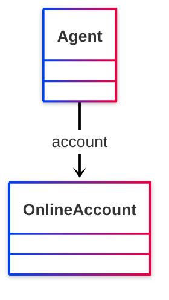

# [Friend of a Friend (FOAF) vocabulary](../homepage.md) > account

## account

> **Indicates an account held by this agent.**

- Range :[http://xmlns.com/foaf/0.1/OnlineAccount](../class/OnlineAccount.md)

- Domain :[http://xmlns.com/foaf/0.1/Agent](../class/Agent.md)

## Schema



## Serialized

```ttl
@prefix foaf: <http://xmlns.com/foaf/0.1/> .
@prefix ns1: <http://www.w3.org/2003/06/sw-vocab-status/ns#> .
@prefix owl: <http://www.w3.org/2002/07/owl#> .
@prefix rdf: <http://www.w3.org/1999/02/22-rdf-syntax-ns#> .
@prefix rdfs: <http://www.w3.org/2000/01/rdf-schema#> .

foaf:account a rdf:Property,
        owl:ObjectProperty ;
    rdfs:label "account" ;
    rdfs:comment "Indicates an account held by this agent." ;
    rdfs:domain foaf:Agent ;
    rdfs:isDefinedBy foaf: ;
    rdfs:range foaf:OnlineAccount ;
    ns1:term_status "testing" .


```

---

Documentation generated on 2025-05-13

Generated with <kbd>[📑 ontodoc](https://github.com/StephaneBranly/ontodoc)</kbd>, *v0.0.3*