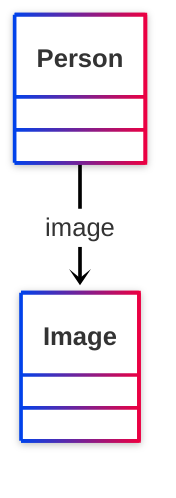

# [Friend of a Friend (FOAF) vocabulary](../homepage.md) > img

## image

> **An image that can be used to represent some thing (ie. those depictions which are particularly representative of something, eg. one's photo on a homepage).**

- Range :[http://xmlns.com/foaf/0.1/Image](../class/Image.md)

- Domain :[http://xmlns.com/foaf/0.1/Person](../class/Person.md)

## Schema



## Serialized

```ttl
@prefix foaf: <http://xmlns.com/foaf/0.1/> .
@prefix ns1: <http://www.w3.org/2003/06/sw-vocab-status/ns#> .
@prefix owl: <http://www.w3.org/2002/07/owl#> .
@prefix rdf: <http://www.w3.org/1999/02/22-rdf-syntax-ns#> .
@prefix rdfs: <http://www.w3.org/2000/01/rdf-schema#> .

foaf:img a rdf:Property,
        owl:ObjectProperty ;
    rdfs:label "image" ;
    rdfs:comment "An image that can be used to represent some thing (ie. those depictions which are particularly representative of something, eg. one's photo on a homepage)." ;
    rdfs:domain foaf:Person ;
    rdfs:isDefinedBy foaf: ;
    rdfs:range foaf:Image ;
    rdfs:subPropertyOf foaf:depiction ;
    ns1:term_status "testing" .


```

---

Documentation generated on 2025-05-11

Generated with <kbd>[📑 ontodoc](https://github.com/StephaneBranly/ontodoc)</kbd>, *v0.0.2*