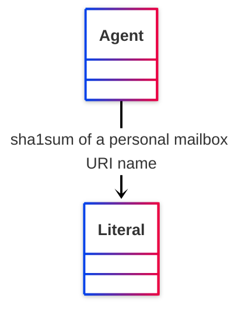

# [Friend of a Friend (FOAF) vocabulary](../homepage.md) > mbox_sha1sum

## sha1sum of a personal mailbox URI name

> **The sha1sum of the URI of an Internet mailbox associated with exactly one owner, the  first owner of the mailbox.**

- Range :[http://www.w3.org/2000/01/rdf-schema#Literal](<http://www.w3.org/2000/01/rdf-schema#Literal>)

- Domain :[http://xmlns.com/foaf/0.1/Agent](../class/Agent.md)

## Schema



## Serialized

```ttl
@prefix foaf: <http://xmlns.com/foaf/0.1/> .
@prefix ns1: <http://www.w3.org/2003/06/sw-vocab-status/ns#> .
@prefix owl: <http://www.w3.org/2002/07/owl#> .
@prefix rdf: <http://www.w3.org/1999/02/22-rdf-syntax-ns#> .
@prefix rdfs: <http://www.w3.org/2000/01/rdf-schema#> .

foaf:mbox_sha1sum a rdf:Property,
        owl:DatatypeProperty,
        owl:InverseFunctionalProperty ;
    rdfs:label "sha1sum of a personal mailbox URI name" ;
    rdfs:comment "The sha1sum of the URI of an Internet mailbox associated with exactly one owner, the  first owner of the mailbox." ;
    rdfs:domain foaf:Agent ;
    rdfs:isDefinedBy foaf: ;
    rdfs:range rdfs:Literal ;
    ns1:term_status "testing" .


```

---

Documentation generated on 2025-05-11

Generated with <kbd>[📑 ontodoc](https://github.com/StephaneBranly/ontodoc)</kbd>, *v0.0.2*