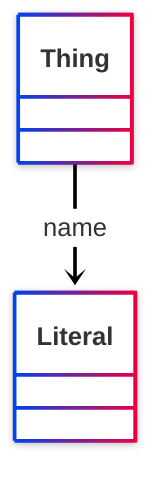

# [Friend of a Friend (FOAF) vocabulary](../homepage.md) > name

## name

> **A name for some thing.**

- Range :[http://www.w3.org/2000/01/rdf-schema#Literal](<http://www.w3.org/2000/01/rdf-schema#Literal>)

- Domain :[http://www.w3.org/2002/07/owl#Thing](<http://www.w3.org/2002/07/owl#Thing>)

## Schema




## Serialized

```ttl
@prefix foaf: <http://xmlns.com/foaf/0.1/> .
@prefix ns1: <http://www.w3.org/2003/06/sw-vocab-status/ns#> .
@prefix owl: <http://www.w3.org/2002/07/owl#> .
@prefix rdf: <http://www.w3.org/1999/02/22-rdf-syntax-ns#> .
@prefix rdfs: <http://www.w3.org/2000/01/rdf-schema#> .

foaf:name a rdf:Property,
        owl:DatatypeProperty ;
    rdfs:label "name" ;
    rdfs:comment "A name for some thing." ;
    rdfs:domain owl:Thing ;
    rdfs:isDefinedBy foaf: ;
    rdfs:range rdfs:Literal ;
    rdfs:subPropertyOf rdfs:label ;
    ns1:term_status "testing" .


```

---

Documentation generated on 2025-05-02

Generated with [📑 ontodoc](https://github.com/StephaneBranly/ontodoc), *v0.0.1*