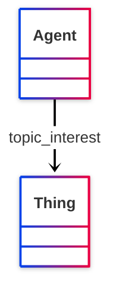

# [Friend of a Friend (FOAF) vocabulary](../homepage.md) > topic_interest
<a name="topic_interest"></a>
## topic_interest

> **A thing of interest to this person.**


- Range :[http://www.w3.org/2002/07/owl#Thing](../<http://www.w3.org/2002/07/owl#Thing>)

- Domain :[http://xmlns.com/foaf/0.1/Agent](../class/Agent.md)

## Schema



## Serialized

```ttl
@prefix foaf: <http://xmlns.com/foaf/0.1/> .
@prefix ns1: <http://www.w3.org/2003/06/sw-vocab-status/ns#> .
@prefix owl: <http://www.w3.org/2002/07/owl#> .
@prefix rdf: <http://www.w3.org/1999/02/22-rdf-syntax-ns#> .
@prefix rdfs: <http://www.w3.org/2000/01/rdf-schema#> .

foaf:topic_interest a rdf:Property,
        owl:ObjectProperty ;
    rdfs:label "topic_interest" ;
    rdfs:comment "A thing of interest to this person." ;
    rdfs:domain foaf:Agent ;
    rdfs:isDefinedBy foaf: ;
    rdfs:range owl:Thing ;
    ns1:term_status "testing" .


```

---

Documentation generated on 2025-06-25

Generated with <kbd>[📑 ontodoc](https://github.com/StephaneBranly/ontodoc)</kbd>, *v0.0.4*